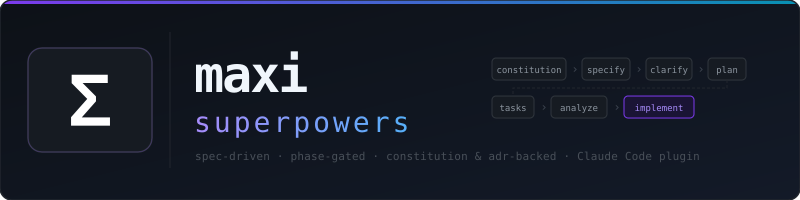

# maxi-superpowers



A spec-driven development plugin for Claude Code, OpenCode, and Antigravity (legacy Gemini CLI also supported). maxi turns "build me X" into a disciplined pipeline — **constitution → spec → clarify → plan → tasks → analyze → implement** — and gates each phase so nothing ships without the design artifacts to back it. Under the hood it delegates implementation to [superpowers](https://github.com/obra/superpowers) (TDD, subagents, code review).

**Why maxi?**

- **Design before code** — every feature gets a written spec, plan, and task list, not just a prompt and a diff.
- **Phase gating** — skills refuse to run out of order, so you can't skip clarification and discover the gap at implementation time.
- **Decisions are recorded** — architectural choices become ADRs automatically (with your consent), so the *why* survives.
- **Greenfield or brownfield** — start a fresh project, or reverse-engineer an existing codebase into spec baselines.

## Installation

### For Claude Code
```bash
# From the plugin marketplace (plugin name: maxi):
claude plugin install maxi

# Or install locally:
git clone https://github.com/amoutiers/maxi-superpowers
cd maxi-superpowers
claude plugin install .
```

### For Antigravity CLI
```bash
# Install locally:
git clone https://github.com/amoutiers/maxi-superpowers
cd maxi-superpowers
agy plugin install .

# Or import your legacy Gemini extensions:
agy plugin import gemini
```

### For OpenCode
Add to your `opencode.json`:
```json
{
  "plugin": ["maxi-superpowers@git+https://github.com/amoutiers/maxi-superpowers.git"]
}
```
Then restart OpenCode. See [`.opencode/INSTALL.md`](.opencode/INSTALL.md) for details.

### For Legacy Gemini CLI (deprecated — use Antigravity)
```bash
# Install from the GitHub repository:
gemini extensions install https://github.com/amoutiers/maxi-superpowers

# Or install locally:
git clone https://github.com/amoutiers/maxi-superpowers
cd maxi-superpowers
gemini extensions install .
```

## Start here

- **New project?** Follow the [Quick Start](#quick-start) below — `/maxi:constitution`, then `/maxi:specify <feature>`.
- **Existing codebase?** Jump to [Onboarding an existing project](#onboarding-an-existing-project) — migrate your spec-kit specs, or reverse-engineer your code into spec baselines.

You don't have to memorize commands: describe what you want and maxi routes you to the right skill, or type the `/maxi:*` command explicitly. A constitution is required before the pipeline and the brownfield/ADR migrations, so **run `/maxi:constitution` first** — with one exception: spec-kit migrants run `/maxi:migrate-from-speckit`, which brings their existing constitution over.

## Quick Start

Your first feature, end to end:

```
/maxi:constitution                         # one-time: establish your project's principles
/maxi:specify add email + password login   # start a spec via guided Q&A      (→ specified)
/maxi:clarify                              # answer any open questions         (→ clarified)
/maxi:plan                                 # technical plan + ADR proposals    (→ planned)
/maxi:tasks                                # checkbox task list                (→ tasked)
/maxi:analyze                              # 7-pass quality audit              (→ analyzed)
/maxi:implement                            # TDD execution + code review       (→ done)
```

Each command reads the previous artifacts and refuses to run if the spec is in the wrong phase — so the path is hard to get wrong. Artifacts land in `docs/maxi/` (see [Artifact Structure](#artifact-structure)).

## Pipeline Commands

Full reference for the forward pipeline:

| Command | Description |
|---|---|
| `/maxi:constitution` | Establish or amend project principles — required before any other command |
| `/maxi:specify` | Create a new feature spec via guided design dialogue |
| `/maxi:clarify` | Resolve open questions in a spec before planning |
| `/maxi:plan` | Generate a technical implementation plan from the spec |
| `/maxi:tasks` | Extract a structured checkbox task list from the plan |
| `/maxi:analyze` | Run a 7-pass quality audit across all artifacts (includes ADR alignment) |
| `/maxi:implement` | Execute the task list and transition the spec to `done` |

> Beyond the forward pipeline there are lifecycle commands (`/maxi:board`, `/maxi:park`, `/maxi:resume`, `/maxi:cancel`, `/maxi:revise`) and the migration utilities covered under [Onboarding an existing project](#onboarding-an-existing-project).

## Artifact Structure

```
docs/
  maxi/
    constitution.md        # project principles (required by all skills)
    adr/                   # Architecture Decision Records (auto-captured during plan + implement)
      README.md            # auto-maintained index
      0001-slug.md         # NNNN-slug.md format
    specs/
      0001-my-feature/
        spec.md            # requirements, user stories, success criteria
        plan.md            # technical design and approach
        tasks.md           # checkbox task list extracted from plan
        analysis.md        # 7-pass quality audit output
```

## Architecture Decision Records

ADRs are captured automatically — you don't create them manually. During `/maxi:plan`, the skill scans the produced plan for architectural choices (tech stack, storage, framework) and proposes an ADR for each. During `/maxi:implement`, unplanned forks that surface mid-implementation also trigger a proposal. In both cases you see the full draft and choose yes/no/edit before anything is written.

ADRs are append-only: once accepted, only status/supersede fields can change. To revise a decision, create a new ADR that supersedes the old one. `/maxi:analyze` includes a Pass G that cross-checks ADRs against the constitution and each other.

## Status State Machine

Every `spec.md` carries a `status:` field in its YAML frontmatter. Skills enforce this order:

```
drafting → specified → clarified → planned → tasked → analyzed → implementing → done
```

Skipping or reversing a status is blocked by the skill that owns each transition.

## Vendored Superpowers Skills

maxi-superpowers vendors [superpowers v6.0.3](https://github.com/obra/superpowers) via git subtree. All superpowers skills are available as `maxi:<skill>` (e.g., `/maxi:brainstorming`, `/maxi:writing-plans`, `/maxi:test-driven-development`). The pipeline skills delegate to them at the right moments — you don't invoke them directly.

## Onboarding an existing project

Two **non-destructive** paths bring an existing project onto maxi, depending on what you already have:

- **You use [github-spec-kit](https://github.com/github/spec-kit)** — `/maxi:migrate-from-speckit` does a one-shot migration: it copies your specs to `docs/maxi/specs/`, adds YAML frontmatter, infers status, and brings your constitution over. Originals in `specs/` and `.specify/` are never touched. (No separate `/maxi:constitution` needed — this provides it.)
- **You have code but no specs (brownfield)** — first run `/maxi:constitution` to establish principles (**required** — the next step refuses to run without it), then `/maxi:migrate-from-brownfield` reverse-engineers your code into faithful `spec.md` baselines (status `done`, `origin: reverse-engineered`), every requirement carrying a `file:line` reference. It discovers feature boundaries, lets you select which to document in waves, drafts an as-built spec per boundary, and adversarially verifies each draft against the code before you accept it.

After **either** path, optionally run `/maxi:migrate-adr` to bootstrap your ADR log — it imports existing ADRs (Nygard / MADR / plain Markdown) and discovers undocumented architectural decisions from your code, config, and git history.

Reverse-engineered baselines land at `done`; to change a documented feature later, run `/maxi:revise` on its spec to roll it back into the forward pipeline.

## Contributing

See [CLAUDE.md](CLAUDE.md) for contributor guidelines. Key rules:

- All new skills must be authored via `superpowers:writing-skills` — do not hand-write SKILL.md files.
- Do not hand-edit files under `skills/` that originate from superpowers. Run `scripts/sync-superpowers.sh` to re-sync after a version bump.
- Run `bash tests/run-all.sh` before committing — all checks must pass.

## License

MIT
