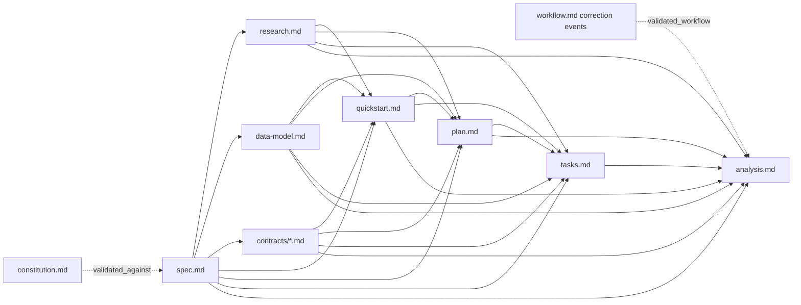

# Data Model: Artifact Revisions and Analysis Convergence

> **Superseded historical artifact.**
>
> The content below is archival only and does not prescribe active Maxi behavior.
> It does not require creating or writing `workflow.md`, `.maxi-ops`, `workflow-ledger.sh`, or `x-artifact-graph`.
> Active requirements are governed by the current `spec.md`, `plan.md`, and `tasks.md`.

## Artifact metadata

| Field | Type | Required | Rules |
|---|---|---|---|
| `revision` | integer | New mutable artifacts | Starts at 1; missing means legacy revision 0; structural governed writes increment by exactly 1. |
| `derived_from` | ordered list of strings | Mutable derived artifacts | Canonical `relative/path.md@revision`; sorted by path; no duplicates; every direct mutable content input appears exactly once. |
| `validated_against` | string | Active root `spec.md` after a phase gate | Canonical constitution `relative/path.md@revision`; represents whole-graph semantic alignment at the gate and does not create a content-staleness edge. |
| `validated_workflow` | string | Analysis reports | `sha256:<64 lowercase hex>` over canonical correction events only; refreshed by analysis; lifecycle-only events do not change it. |
| `related_adrs` | ordered list of full ADR slugs | Specs and plans when applicable | References immutable ADR identity; validated separately from mutable dependencies. |

Operational exemptions from structural revision increments are limited to `updated`, `status`, `parked_from`, task checkbox state, `related_adrs`, `validated_against`, and `validated_workflow`. A write mixing exempt and structural changes increments once.

Legacy state is valid only when both `revision` and `derived_from` are absent. The validator supplies virtual expected edges at revision 0. Mixed presence is a schema error. A virtual edge becomes stale as soon as its expected input has a positive revision.

## Artifact graph



Edges are stored on the dependent artifact. The validator traverses them from the requested gate and reports the complete path, ordering failures by earliest correction-owner rank rather than filename.

## Workflow ledger

`workflow.md` frontmatter:

```yaml
---
slug: 0019-artifact-analysis-convergence
spec_slug: 0019-artifact-analysis-convergence
created: 2026-08-01
updated: 2026-08-01
revision: 1
---
```

Body events are append-only and sequential under two exact markers:

```markdown
## Lifecycle Events

### E001 - park

- Date: 2026-08-01
- From: tasked
- To: parked
- Reason: Waiting for provider access.

## Correction Cycles

### E002 - revise

- Date: 2026-08-01
- From: tasked
- To: planned
- Reason: Task T014 omits FR-020.
- Findings: F003
- Consent: explicit-user
- Correction cycle: 1
```

`workflow.md` contains semantic events only: `park`, `resume`, `cancel`, `revise`, `gate-failed`, `correction-authorized`, `correction-consumed`, `phase-completed`, and `correction-stopped`. Lifecycle events live above `## Correction Cycles`; correction-scoped events live below it. Correction-cycle events carry a cycle ID and next expected phase; a pre-cycle `gate-failed` uses `cycle: none` and names the owner and required rollback. Event and cycle IDs are never recycled. Updating the ledger increments only its own revision. The latest semantic event plus the current spec status is resumable goal state; chat context is never state. A passing analysis closes a cycle without a post-analysis ledger write, because the passing report already validates the final correction-state hash.

Write-ahead mechanics live outside the hashed ledger in `<spec-dir>/.maxi-ops/<operation-id>/`. The operation directory contains a manifest, staged files, and append-only `prepared`, `write-started`, `write-completed`, `completed`, or `recovery-conflict` records. It is durable until completion but is neither a mutable content artifact nor an input to `validated_workflow`. This separation prevents operation evidence from circularly changing the hash that a staged `analysis.md` must contain.

`workflow-ledger.sh` is the only writer for both semantic ledger events and operation journals. Each operation record has an idempotency key. Repeating the same key and payload returns the existing record; reusing a key with different payload records `recovery-conflict` and stops.

`correction-consumed` is a semantic write-ahead event recorded in `workflow.md` before the first rollback mutation. Before any phase mutation, the owner renders every output, including the next `workflow.md` and any status-only spec update, in the operation directory, validates the graph through the staged overlay, and records exact before/after hashes and revisions in the operation manifest. Each target then receives operation-journal `write-started`, atomic replacement from its staged file, and `write-completed`. Staged files are removed only after operation completion. Recovery follows one table:

| Observed state after a started operation | Recovery |
|---|---|
| Exact recorded before-state plus staged file matching the expected after hash | Perform the atomic replacement once. |
| Target matches the exact expected after hash and revision | Record completion; do not regenerate. |
| Existing completion event with matching after-state | Skip the mutation. |
| Anything else, including a missing/mismatched staged file, malformed output, unexpected hash, or revision jump | Append `recovery-conflict` and stop for user repair. |

For pre-analysis correction phases, semantic `phase-completed` is included in the prepared `workflow.md` and replaced with the other phase outputs. Final analysis uses two stable operations. The report operation overlays and validates `analysis.md` (plus a prepared `workflow.md` when `correction-stopped` is required) while canonical spec status remains `tasked`. Only after that candidate passes does a separate status operation overlay the spec at `analyzed`, run the implement gate against that projection, and atomically replace the spec. Neither operation appends a later semantic workflow event; completion is recorded only in `.maxi-ops`, so it cannot stale or circularly define `validated_workflow`. Lifecycle operations use the same external journal while their semantic event remains above the correction marker. This ordering makes crashes after authorization, consumption, status change, artifact replacement, or phase completion resumable without duplicate writes.

`validated_workflow` is computed over the exact UTF-8 bytes beginning with `## Correction Cycles` and ending with one normalized LF. The validator rejects a missing/duplicated marker, correction events above it, lifecycle events below it, CRLF, or missing final LF. This makes the digest portable without interpreting free-form reasons.

## Analysis report

Frontmatter:

```yaml
---
slug: 0019-artifact-analysis-convergence
spec_slug: 0019-artifact-analysis-convergence
created: 2026-08-01
updated: 2026-08-01
revision: 2
derived_from:
  - contracts/analysis-report.md@1
  - contracts/artifact-metadata.md@1
  - contracts/validator-cli.md@1
  - data-model.md@1
  - plan.md@4
  - quickstart.md@1
  - research.md@1
  - spec.md@3
  - tasks.md@2
validated_workflow: sha256:8d969eef6ecad3c29a3a629280e686cff8ca4a9cbf2848e95c15d07e4dcfd51
result: failed
review_mode: independent
reviewer_ref: session-opaque-id
review_origin: isolated-agent
reviewed_findings_sha256: 7f83b1657ff1fc53b92dc18148a1d65dfa13514b0947cb60f3217b3f1f1b39e8
---
```

Finding registry columns:

| Field | Values / rules |
|---|---|
| `ID` | `F001` to `F999`; stable and never recycled. |
| `Fingerprint` | Stable normalized meaning key; unique among registry entries. |
| `Category` | ambiguity, contradiction, missing-requirement, unjustified-decision, constitution, adr, testability, feasibility, codebase-gap, deterministic. |
| `Severity` | CRITICAL, HIGH, MEDIUM, LOW. |
| `State` | open, resolved, accepted, deferred. |
| `Owner` | Earliest mutable content artifact that must change. |
| `Locations` | Current evidence locations; may change without changing ID. |
| `Summary` | Concise semantic statement. |
| `Disposition evidence` | Required rationale for accepted; required existing follow-up spec link for deferred. |
| `Delta` | new, unchanged, resolved. |

Classification disagreements are keyed by the stable finding ID and record the prior category/severity/owner tuple, the current tuple, and reviewer rationale. On a second failed analysis the report also materializes disjoint `Original Unresolved` and `Newly Discovered` lists; disagreement is an orthogonal list because either group can contain a reclassified finding.

`review_origin` is `isolated-agent`, `separate-session`, `self`, or `none`. A generated `reviewer_ref` never upgrades `self` to independent. `reviewed_findings_sha256` covers the canonical semantic columns and excludes user-controlled dispositions. `validated_workflow` covers canonical correction events and excludes lifecycle-only events. `not-run` reports use `review_origin: none`, `reviewer_ref: null`, and `reviewed_findings_sha256: null`.

## Validation result

The validator returns one of:

- exit 0: graph and gate contract valid;
- exit 2: invocation or missing-root error;
- exit 3: schema error;
- exit 4: missing or stale dependency;
- exit 5: cycle;
- exit 6: constitution or ADR reference error;
- exit 7: status or analysis-gate error;
- exit 8: requirement coverage error.
- exit 9: constitution revalidation required before the gate can be decided.

Output lines use `CODE|artifact|dependency_path|message`, one error per line, sorted by correction-owner rank, artifact path, then code. The internal rank is not printed. No write is allowed.
