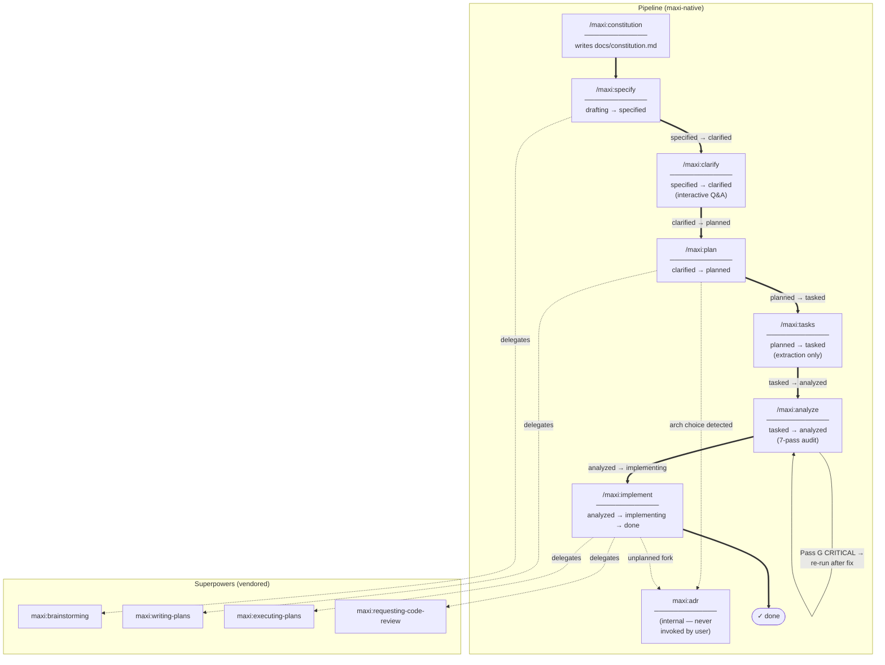

# Pipeline Flow

Visual map of the maxi command pipeline: phase sequence, status transitions, re-run loops, and delegations to vendored superpowers skills.

For the authoritative source on delegation and gating rules, see [delegation-map.md](delegation-map.md).

## Legend

| Arrow style | Meaning |
|---|---|
| `==>` thick arrow | Main pipeline transition (label = status change) |
| `-->` thin arrow | Re-run loop (analyze only — non-destructive) |
| `-.->` dashed arrow | Delegation to a vendored superpowers skill or internal ADR skill |

## Notes

- `/maxi:constitution` has no status prerequisite — it can run at any time.
- Every other phase is mandatory and must run in order — no phase may be skipped.
- `/maxi:analyze` is non-destructive and can be re-run at any status from `tasked` onward; status does not change after the first run.
- `maxi:adr` is internal and is never invoked directly by the user.
