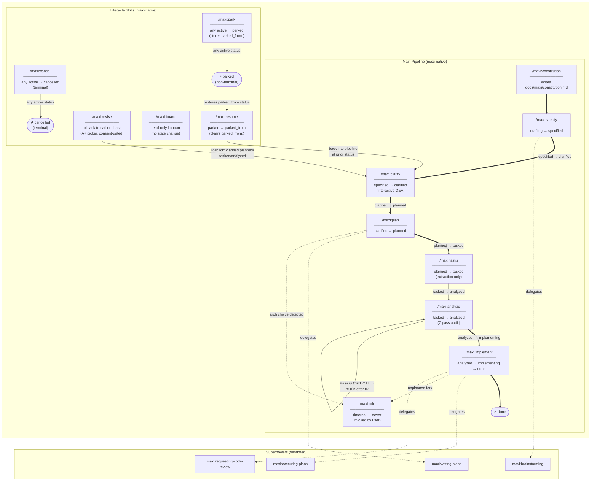

# Pipeline Flow

Visual map of the maxi command pipeline: phase sequence, status transitions, re-run loops, and delegations to vendored superpowers skills.

For the authoritative source on delegation and gating rules, see [delegation-map.md](delegation-map.md).



## Legend

| Arrow style | Meaning |
|---|---|
| `==>` thick arrow | Main pipeline transition (label = status change) |
| `-->` thin arrow | Re-run loop or lifecycle state transition |
| `-.->` dashed arrow | Delegation to a vendored superpowers skill or internal ADR skill |

## Notes

- `/maxi:constitution` has no status prerequisite — it can run at any time.
- Every forward phase is mandatory and must run in order — no phase may be skipped.
- `/maxi:analyze` is non-destructive and can be re-run at any status from `tasked` onward; status does not change after the first run.
- `maxi:adr` is internal and is never invoked directly by the user.
- **Lifecycle skills** (`park`, `resume`, `cancel`, `revise`) operate on any in-flight spec — they are orthogonal to the main forward pipeline.
- `/maxi:revise` is the only skill that makes `status:` go backwards. `RESUME` restores to the exact prior status stored in `parked_from:` — the `CLARIFY` node in the diagram is illustrative.
- `/maxi:board` is read-only — it never changes status.

## FSM Status Set

```
drafting → specified → clarified → planned → tasked → analyzed → implementing → done
                                                                         ↕             ↕
                                                                      parked      cancelled
```

`parked` is reachable from any active status (via `/maxi:park`) and restores to its prior status (via `/maxi:resume`). `cancelled` is terminal.
