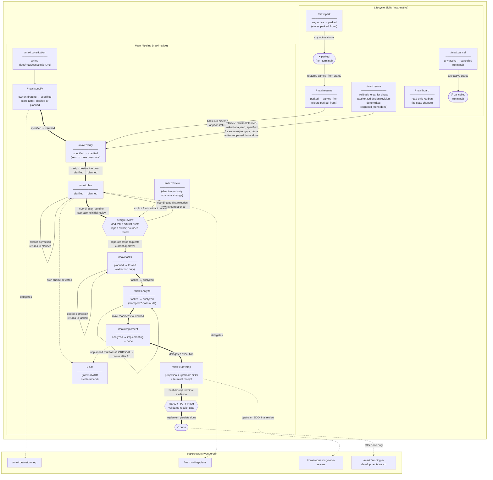

# Pipeline Flow

Visual map of the maxi command pipeline: phase sequence, status transitions, re-run loops, and delegations to vendored superpowers skills.

For the authoritative source on delegation and gating rules, see [delegation-map.md](delegation-map.md).



## Legend

| Arrow style | Meaning |
|---|---|
| `==>` thick arrow | Available forward route; requested destination limits automatic handoffs |
| `-->` thin arrow | Re-run loop or lifecycle state transition |
| `-.->` dashed arrow | Delegation to a vendored superpowers skill or internal skill |
| `{...}` gate | Required external review handoff; no status transition |

## Notes

- `/maxi:constitution` has no status prerequisite — it can run at any time.
- Every forward phase is mandatory and must run in order — no phase may be skipped.
- `/maxi:analyze` is non-destructive and can be re-run at any status from `tasked` onward; status does not change after the first run.
- A passing readiness review is valid only when `analysis.md` carries `maxi-readiness-v2` and its recorded structural spec/tasks hashes, exact plan hash, and `review_inputs_sha256` match the current artifacts and decision inputs; `/maxi:implement` verifies this with an explicit project root before every new or resumed dispatch and otherwise stops for `/maxi:analyze`.

Design approval uses `maxi-design-review-v1` with exact spec/plan hashes and the same decision-input digest: exact constitution bytes and names/bytes of every direct ADR Markdown file except generated README.md, regardless of status. Owners capture original hashes before reading, review the complete decision-input snapshot, and compare before report/status writes. Candidate-based stamping atomically publishes only after comparing the original supplied digest; failure preserves prior evidence. Tasks and implement resolve verifiers from loaded installed skills, never client fallbacks; legacy evidence requires a new actual review or analysis. Only `DESIGN_REVIEW_VERIFIED` permits extraction, and only `READINESS_VERIFIED` permits new/resumed implementation.
- `x-adr` is internal and is never invoked directly by the user. Every new ADR records its creating spec through a direct `spec` link or uses `spec: null`. During an initial active lifecycle (`drafting` through `implementing`) that lacks the monotone `reopened_from: done` watermark, a detected change to an accepted ADR linked to the current spec triggers an agent-proposed active-spec amendment: `x-adr` shows the full amended ADR and exact diff, then writes only after explicit approval. Missing or null links, specs at `done`, `parked`, or `cancelled`, and reopened specs marked `reopened_from: done` use closed-spec supersession instead. This cross-cutting route does not add a status or transition.
- Bare specify and spec-only creation coordinate author then actual clarification to `clarified`; explicit design validation and design revisions coordinate affected owners through `planned` plus a bounded review round. Owner-only calls return after their own write. Artifact owners are skill responsibilities executed sequentially in the current agent through their required instructions; skill delegation does not inherently require another agent. The independent design reviewer remains separate. Draft-only, edit-only and phase-only requests stop at the requested owner. Public `/maxi:review` is report-only, with no correction. Standalone initial planning retains one initial review; its nested dispatch is suppressed under a coordinator. Coordinated review reserves at most two passes in the existing report, corrects all first-pass findings once and reuses the reviewer where available; interruption never resets the allowance. No design operation invokes tasks, analyze or implement. The dedicated reviewer receives the complete current artifacts and accepted `related_adrs`; missing or stale approval blocks task extraction. Task `Files` lists identify primary edits, not implementation allowlists.
- Every newly written `plan.md` carries exactly one `Global Constraints` section containing only applicable durable cross-task constraints from the spec and constitution; transient execution state and individual mutation authority are excluded, while a durable rule requiring fresh authorization is allowed.
- The 19 Maxi-native skills: 13 user-facing, 2 internal, 1 session, and 3 migration skills. The 10-state FSM remains unchanged. `/maxi:x-develop` maps canonical Maxi `TNNN` tasks to an immutable SDD `Task N` projection. Upstream SDD owns task review, fix rounds, and the final implementation review. `/maxi:x-develop` is the sole incremental Maxi checkbox owner; `/maxi:implement` validates that every task is checked and alone persists `implementing → done`. Branch finishing starts only after Maxi has recorded `done`.
- Upstream SDD owns the only whole-branch review. Before final-review work, `/maxi:x-develop` persists the immutable initial task-selection anchor in the ordinary SDD ledger. On Codex it allocates a fresh reviewer for an identity handshake, persists the harness-returned canonical task path, then sends the review through a follow-up to that reviewer. It regenerates the Git review package byte-for-byte and returns `READY_TO_FINISH` only with a valid hash-bound terminal receipt. `/maxi:implement` alone then persists `done`; it never dispatches a duplicate final review.
- Current execution uses complete-body `maxi-v2` projections; immutable `maxi-v1` files remain verifiable historical predecessors. New projections retain the preamble and render each selected TNNN heading, canonical checkbox line, and complete mapped plan-task body in tasks-file order. Every canonical task, including checked tasks, requires exactly one terminal `(plan Task N)` mapping, bijective with the positive executable plan headings; missing, duplicate, non-positive, unknown, or unmapped entries require owner correction before publication. Plans must end with LF so extraction preserves the final payload line. Closed three-character backtick or tilde fences, optionally indented, normalize to column-zero triple backticks in the preamble and task bodies while preserving payload bytes. Longer or unclosed delimiters and payload lines that would toggle upstream fence state reject; fenced Task-like headings never enter native selection or completion maps. A validated active v1 projection upgrades only through an ordinary projection call to a new `<slug>-v2-p-<plan12>-t-<tasks12>-sdd.md` successor; its file and ledger remain unchanged. `--verify-only` requires an existing current v2 identity and never creates project directories, evidence, or upgrades. Only an unchanged-source v1 upgrade completed by validated ledgers may create an empty successor, which still requires a fresh final review; all-completed structural changes reject.

- Only canonical annotated upstream completion records acquit tasks; bare or malformed completion lines fail closed. The accepted annotations are `review clean` or a positive `K parked`, with exactly two seven-hex commit IDs.
- A null fix package requires exactly `**Ready to merge?** Yes`; a non-null byte-exact fix package requires the initial `**Ready to merge?** With fixes` plus exactly `**Fix round:** All findings addressed, no new Critical/Important breakage`.
- Every projection's exact distributed bytes are SHA-256-bound by its ordinary SDD ledger; missing, duplicate, malformed, or mismatched projection-byte anchors fail closed across the current and predecessor lineage.
- Removing an anchored incomplete `TNNN` during structural correction fails before successor creation and leaves the active-projection pointer unchanged.
- Complete ledger lines containing `Ruling:` are preserved byte-for-byte in lineage order and hash-bound by the terminal receipt.
- The three fixed boundaries are design review after the normal plan write, readiness review in `/maxi:analyze` before implementation, and the upstream SDD final implementation review. They are gates, not statuses or automatic phase transitions.
- **Lifecycle skills** (`park`, `resume`, `cancel`, `revise`) operate on any in-flight spec — they are orthogonal to the main forward pipeline.
- `/maxi:revise` is the only skill that makes `status:` go backwards. On an authorized rollback from `done`, it writes the monotone `reopened_from: done` watermark; `RESUME` restores to the exact prior status stored in `parked_from:` — the `CLARIFY` node in the diagram is illustrative.
- `/maxi:revise` offers the exceptional `specified` rollback only for a demonstrated missing or ambiguous requirement in the source spec; it resumes at `clarify` and never reruns `specify`.
- `/maxi:board` is read-only — it never changes status.
- **Ingress skills** (`migrate-from-speckit`, `migrate-from-brownfield`) document already-implemented code, so they create specs at a terminal/advanced status on creation rather than walking the forward pipeline. They mark provenance (`origin:` / inferred status) and never alter forward-spec gating — sanctioned by the constitution's migration-ingress clause and [ADR-0011](maxi/adr/0011-migration-ingress-terminal-status.md). No new FSM status is introduced.

## FSM Status Set

The 10-state FSM remains unchanged. Review boundaries do not add states or transitions.

```
drafting → specified → clarified → planned → tasked → analyzed → implementing → done
                                                                         ↕             ↕
                                                                      parked      cancelled
```

`parked` is reachable from any active status (via `/maxi:park`) and restores to its prior status (via `/maxi:resume`). `cancelled` is terminal.
