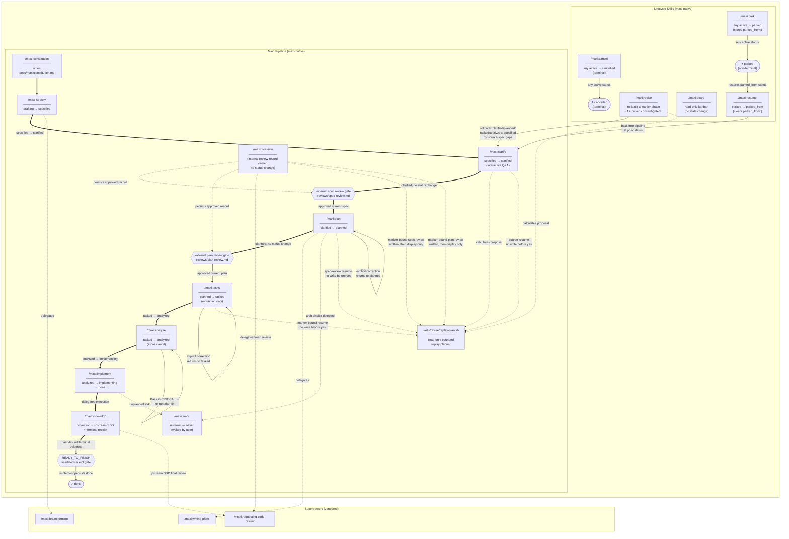

# Pipeline Flow

Visual map of the maxi command pipeline: phase sequence, status transitions, re-run loops, and delegations to vendored superpowers skills.

For the authoritative source on delegation and gating rules, see [delegation-map.md](delegation-map.md).



## Legend

| Arrow style | Meaning |
|---|---|
| `==>` thick arrow | Main forward route (label states a status change or gate condition) |
| `-->` thin arrow | Re-run loop or lifecycle state transition |
| `-.->` dashed arrow | Delegation to a vendored superpowers skill or internal skill |
| `{...}` gate | Required external review handoff; no status transition |

## Notes

- `/maxi:constitution` has no status prerequisite — it can run at any time.
- Every forward phase is mandatory and must run in order — no phase may be skipped.
- `/maxi:analyze` is non-destructive and can be re-run at any status from `tasked` onward; status does not change after the first run.
- `/maxi:x-adr` is internal and is never invoked directly by the user.
- `/maxi:x-review` is internal. It is the sole writer of `reviews/spec-review.md` and `reviews/plan-review.md`; each approved review record is persisted and versioned.
- Upstream SDD owns the only whole-branch review. `/maxi:x-develop` persists the harness-issued final-reviewer identity, regenerates the Git review package byte-for-byte, and returns `READY_TO_FINISH` only with a valid hash-bound terminal receipt. `/maxi:implement` alone then persists `done`; it never dispatches a duplicate final review.
- The two external review handoffs are gates, not statuses or automatic replay phases. For a marker-bound root, `/maxi:plan` requires the current approved specification review, and `/maxi:tasks` requires the current approved plan review.
- `skills/revise/replay-plan.sh` is a read-only planner: it calculates a bounded stale-descendant continuation and stops at the next required review handoff. It never writes artifacts, creates or approves reviews, or executes phases.
- Bounded replay is future-only. Eligible roots carry exactly one `replay_contract: bounded-v1`; only `/maxi:specify` writes this marker, during normal forward-spec creation. An unmarked existing, migrated, or reverse-engineered spec returns `UNSUPPORTED_LEGACY`; revision metadata alone never opts it in.
- For a marker-bound root, `reviewed_sha256` hashes the canonical structural projection, which omits only root-frontmatter `status:` and `updated:`, preserves every other line in order, and hashes one LF after each retained line. The exact ten-field review envelope is `revision`, `writer_context`, `structural_contributors`, `derived_from`, `reviewed_document`, `reviewed_revision`, `reviewed_sha256`, `reviewer_context`, `reviewer_context_matches_harness`, and `verdict`. Before delegation, artifact write, or status/timestamp change, `plan` and `tasks` require positive record and reviewed revisions, exactly one mapped direct input, the exact current subject/revision/digest, canonical unique contributors and contexts, writer equals reviewer and appears in contributors, harness equality exactly `true`, verdict exactly `approved`, and reviewer independence from the subject contributors.
- The persisted continuation is `replay_continuation: clarify@<current-spec-revision>` after the exceptional source rollback; `/maxi:clarify` can re-present it with `--resume-current-source` after rejection, ambiguity, or interruption. `--resume-current-source` is legal only for `spec.md`, start phase `clarify`, and that matching current marker. Clarification replaces it with `replay_continuation: plan@<current-spec-revision>`. After `x-review` writes the matching spec review, `/maxi:plan` can re-present the spec review continuation with `--resume-current-review`; a consented plan write persists `replay_continuation: tasks@<current-plan-revision>`. After the matching plan review, `/maxi:tasks` can re-present the plan review continuation with `--resume-current-review`. `--resume-current-review` accepts exactly two combinations: `reviews/spec-review.md` with `plan`, or `reviews/plan-review.md` with `tasks`; both require the current subject and review plus every transitive `derived_from` ancestor. Each displayed executable segment requires its own fresh literal `yes`.
- Before plan resume, a stale `spec.md`, support artifact, or specification review is rejected before any continuation output or write, even when `plan.md` and its plan review still match.
- An explicit owner-managed plan correction is available only when explicitly requested at `planned`, `tasked`, `analyzed`, or `implementing`; it preserves the current spec-review gate, writes `replay_continuation: tasks@<current-plan-revision>` with the corrected plan, and returns only to `planned`.
- An explicit owner-managed tasks correction is available only when explicitly requested at `tasked`, `analyzed`, or `implementing`; it preserves the current plan-review gate and returns only to `tasked`.
- After `x-review` writes a marker-bound approved plan review, it immediately invokes the read-only planner with the predecessor review revision and displays the current approved `tasks -> analyze` continuation. `x-review` never executes a phase or obtains consent.
- For that marker-bound continuation, `/maxi:tasks` is only the later no-write resume presenter: it invokes the read-only planner with `--resume-current-review`, redisplays the current approved `tasks -> analyze` continuation, and requires a fresh literal `yes` before extraction. Rejection, ambiguity, or session interruption changes nothing and the same current review can be presented again.
- Only new specs created through the normal forward pipeline receive this revision and replay behavior; existing, migrated, and reverse-engineered specs remain untouched. For an unmarked root, plan and tasks use the ordinary pipeline: no review record, x-review handoff, review provenance, review reporting, or replay planner is required. This mechanism never creates or writes `workflow.md` or `.maxi-ops`.
- **Lifecycle skills** (`park`, `resume`, `cancel`, `revise`) operate on any in-flight spec — they are orthogonal to the main forward pipeline.
- `/maxi:revise` is the only skill that makes `status:` go backwards. `RESUME` restores to the exact prior status stored in `parked_from:` — the `CLARIFY` node in the diagram is illustrative.
- `/maxi:revise` offers the exceptional `specified` rollback only for a demonstrated missing or ambiguous requirement in the source spec; replay resumes at `clarify` and never reruns `specify`.
- `/maxi:board` is read-only — it never changes status.
- **Ingress skills** (`migrate-from-speckit`, `migrate-from-brownfield`) document already-implemented code, so they create specs at a terminal/advanced status on creation rather than walking the forward pipeline. They mark provenance (`origin:` / inferred status) and never alter forward-spec gating — sanctioned by the constitution's migration-ingress clause and [ADR-0011](maxi/adr/0011-migration-ingress-terminal-status.md). No new FSM status is introduced.

## FSM Status Set

The 10-state FSM remains unchanged. Review gates and replay proposals do not add states or transitions.

```
drafting → specified → clarified → planned → tasked → analyzed → implementing → done
                                                                         ↕             ↕
                                                                      parked      cancelled
```

`parked` is reachable from any active status (via `/maxi:park`) and restores to its prior status (via `/maxi:resume`). `cancelled` is terminal.
