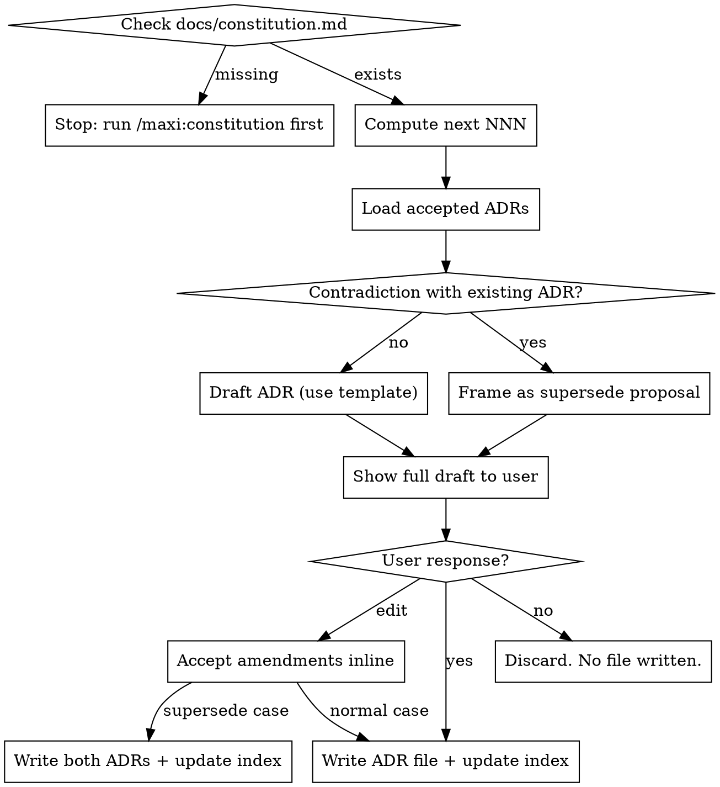

# maxi: Recording Architecture Decision Records (ADRs)

## Overview

This is an **internal pipeline skill** — it is invoked by `maxi:plan` and `maxi:implement`, not by the user directly. It is not listed in the `/maxi:*` command menu.

**Core principle:** ADRs capture the *why* behind architectural choices. They are **never written silently** — the agent always drafts the ADR, shows it to the user, and waits for explicit approval before any file is created.

## Prerequisites

Before doing anything else:

1. Check that `docs/constitution.md` exists. If it does not: stop immediately with *"No constitution found. Run `/maxi:constitution` first."*
2. Proceed only when constitution is confirmed present.

## The Iron Rule: Never Write Without Consent

**You MUST show the full drafted ADR and receive an explicit `yes` (or `edit`) before writing any file.**

The fact that the calling skill (plan/implement) already identified the decision does NOT count as user consent to write the ADR. The user must see the draft and confirm.

**Rationalizations that are NEVER valid:**
- "The plan made the decision explicit" → still show draft, still ask
- "The context was clear enough" → still show draft, still ask
- "The user asked me to record it" → still show draft, still ask
- "The contradiction isn't really a conflict" → still surface it, let the user decide

## Process



## Step-by-Step

### 1. Compute next NNN

Scan `docs/maxi/adr/` for files matching `NNN-*.md` (excluding `README.md`). Extract the numeric prefix of each file and find the highest value. Next NNN = highest + 1, zero-padded to 3 digits. If the directory does not exist or contains no matching files, NNN = 001.

Use max-based numbering (not count-based) to survive deletions, renames, or manual additions — these operations change the count but not the highest assigned number.

### 2. Load accepted ADRs for contradiction check

Read every `docs/maxi/adr/NNN-*.md` (where status = `accepted`) and scan their Decision sections for domain overlap with the new decision (same technology category: storage, runtime, framework, auth mechanism, etc.).

**Surface any overlap to the user — do not decide silently.** You are not qualified to judge whether two decisions in the same domain are contradictory or simply different contexts. The user is. If there is any resemblance in domain, show it to the user and let them decide whether to supersede or treat as independent.

### 3. Draft the ADR

Verify `templates/adr-template.md` exists (Read tool) before proceeding; if missing, stop: *"Cannot proceed — `templates/adr-template.md` is missing. Please reinstall the maxi plugin."*

Use `templates/adr-template.md` as the base. Fill in:

- `adr:` — the 3-digit number
- `slug:` — `NNN-[short-kebab-title]`
- `status: proposed` ← draft state; transitions to `accepted` when user confirms
- `date:` — today in YYYY-MM-DD
- `updated:` — today in YYYY-MM-DD
- `decider:` — name or role of the decision-maker (ask user if unknown)
- `related_specs:` — spec slug(s) this decision applies to, if known
- `related_principles:` — constitution principle names referenced, if any
- `related_requirements:` — FR-### / SC-### IDs, if applicable
- `supersedes:` — NNN of the ADR being overturned (or `null`)
- `superseded_by: null`

Body: fill Context, Considered Options, Decision, Consequences, Confirmation from the architectural choice that was detected.

### 4. Frame supersede proposal (if contradiction found)

If this decision contradicts an existing accepted ADR (say ADR-003), present the draft with this header:

> **This decision appears to contradict ADR-003 ("original title").** Propose ADR-NNN that supersedes ADR-003?

The proposal shows the full new ADR draft. The user can say yes, edit, or no.

### 5. Show to user and wait

Output the full ADR as formatted Markdown and ask:

> *"Record this as ADR-NNN? (yes / no / edit)"*

Wait for the response. Do not write anything yet.

### 6. Handle user response

**`yes`:**
- Normal case: set `status: accepted` in the ADR, then write `docs/maxi/adr/NNN-slug.md`, then regenerate index (step 7)
- Supersede case: write new ADR; also update old ADR — set `status: superseded` and `superseded_by: NNN`; then regenerate index. If any of the three writes fails, stop and report the failure — do not leave the ADR log in a partially-written state.

**`edit`:**
- Accept the user's amendments to the draft inline
- Apply them to the ADR content
- Write the amended version (normal or supersede rules above)

**`no`:**
- Discard the draft. Do not create any file. Return to the calling skill.

**Anything else (silence, "ok", "sure", "looks good", "cancel", "skip", ambiguous text):**
- Treat as `no` — do not write anything. Re-ask the question once: *"To confirm: skip recording this decision? (yes to record / no to skip)"*. If still ambiguous, treat as no and move on.

### 7. Regenerate docs/maxi/adr/README.md

After every successful write, rewrite the index by scanning all `.md` files in `docs/maxi/adr/` (excluding `README.md`). Sort by ADR number ascending. Read each file's frontmatter for table values. Status must reflect the current frontmatter value (including `superseded` or `deprecated` — do not default to `accepted`).

```markdown
# Architecture Decision Records

| ADR | Title | Status | Date | Related Specs |
|-----|-------|--------|------|---------------|
| [001](001-slug.md) | Title of decision | accepted | 2026-05-08 | 001-csv-to-json |
| [002](002-slug.md) | Another decision | superseded | 2026-05-15 | — |
```

If `related_specs` is empty, write `—` rather than an empty cell.

## Append-Only After Creation

Once an ADR is written, its **content is immutable**. These fields MAY be updated:
- `status` (accepted → deprecated or superseded)
- `superseded_by`
- `supersedes`

These fields and the body sections MUST NOT be edited on an existing ADR:
- Any body section (Context, Options, Decision, Consequences, Confirmation)
- `adr`, `slug`, `date`, `related_specs`, `related_principles`, `related_requirements`

If the user wants to revise a past decision, create a new ADR that supersedes the old one. The old one stays as a historical record.

**If asked to edit an existing ADR's body:** decline and explain — *"ADRs are append-only. To revise this decision, I can create ADR-NNN that supersedes ADR-NNN. Shall I?"*

## Common Mistakes

| Mistake | Correct behaviour |
|---------|-------------------|
| Writing the file before showing the draft | Always show draft first, wait for yes |
| Deciding "this isn't really a contradiction" silently | Surface any resemblance, let user decide |
| Using a manually constructed frontmatter | Use `templates/adr-template.md` as base |
| Picking a number without counting existing files | Count `docs/maxi/adr/*.md` (excluding README), add 1 |
| Forgetting to regenerate README.md | Always regenerate after every write |
| Editing the body of an existing ADR | Decline; offer to supersede instead |
