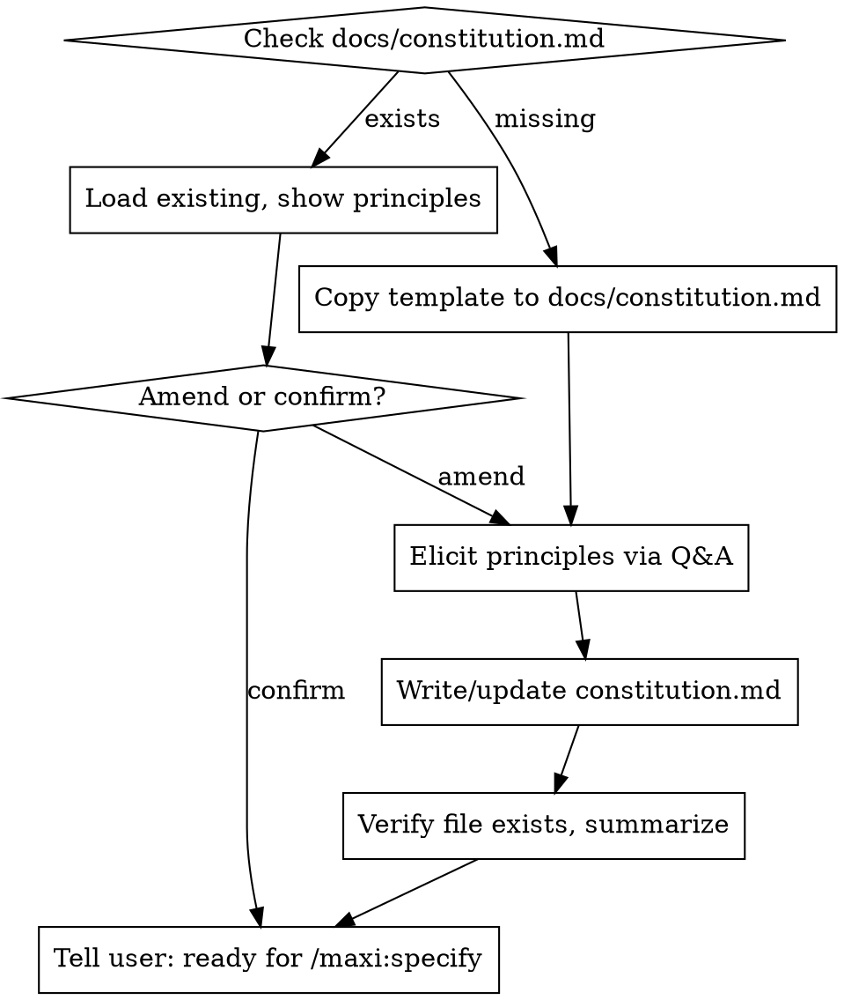

# constitution

Establish or amend the project constitution — the non-negotiable principles that all future `/maxi:*` skills will check against.

**Constitution is the mandatory first step.** All other maxi workflow skills (`/maxi:specify`, `/maxi:plan`, `/maxi:analyze`, etc.) will refuse to run until `docs/constitution.md` exists.

## Canonical Locations

| What | Where |
|------|-------|
| Constitution file | `<project-root>/docs/constitution.md` |
| Template | `<plugin-root>/templates/constitution-template.md` |

**Never put the constitution in the project root, `docs/maxi/constitution.md`, or any other path.** It must be at `docs/constitution.md` exactly — that is the path every downstream skill checks.

## Process

## Elicitation Protocol

Ask one question at a time. Elicit 3–7 principles. Stop at 7.

**Core Principles (non-negotiable invariants)** — ask:
- "What is the single most important constraint this project must never violate?"
- "If a new developer breaks this rule, what should they be told?"
- "What trade-off has your team made that might surprise an outsider?"

**Development Conventions (preferred practices)** — ask:
- "What's your testing philosophy? TDD, test-after, integration-focused?"
- "Any strong preferences on code style, language version, or framework usage?"

**Constraints (external requirements)** — ask:
- "Any compliance, security, or deployment requirements that constrain the design?"
- "Third-party dependencies that are locked in or forbidden?"

## Critical Rules

- **Copy template first.** When creating a new constitution, copy `templates/constitution-template.md` into `docs/constitution.md` before writing anything. Use the template's section structure. After elicitation, set the YAML frontmatter: `version: 1.0.0`, `ratified: [today's ISO date]`, `last_amended: [today's ISO date]`. When amending, bump the version (MAJOR.MINOR.PATCH) and update `last_amended`.
- **Elicit, don't generate.** Never write principles before the user has answered elicitation questions. This applies even if: (a) the user says they're in a hurry, (b) the user says to use "reasonable defaults", (c) the user points to an existing file like `CLAUDE.md` or `README.md`, or (d) the user says to infer from the codebase. In every case, ask the elicitation questions first and write only from the user's answers.
- **CLAUDE.md is not a constitution.** If the user says "use my CLAUDE.md" or points to any existing file, explain that the constitution must follow the template format and be verified through elicitation. You may use the existing file as context for asking better questions, but never copy its content verbatim or use it as a substitute for elicitation.
- **No codebase inference.** Never generate principles by reading source files, configs, or commit history. Principles must come from the user's stated values, not from what you observe in the code.
- **Keep categories separate.** Core Principles ≠ Development Conventions ≠ Constraints. Conflating them makes the constitution unactionable for `/maxi:analyze`.
- **Minimum 3, maximum 7.** Fewer than 3 is incomplete. More than 7 is noise.
- **Verify on write.** After writing, confirm the file exists at `docs/constitution.md`. If it doesn't, diagnose and retry.

## Red Flags

- Writing to any path other than `docs/constitution.md` → **wrong path, redo**
- Generating content before asking any questions → **delete draft, elicit first**
- User said "I'm in a hurry / just use reasonable defaults" and you skipped questions → **elicitation is never optional; ask anyway**
- User pointed to `CLAUDE.md` or another file and you copied its content → **delete draft, explain format mismatch, elicit first**
- You read source files or configs to infer principles without asking the user → **delete draft, elicit first**
- Mixing "use TypeScript strict mode" (convention) with "never store PII unencrypted" (constraint) in the same section → **separate them**
- Writing 10+ principles → **consolidate to 7 maximum**
