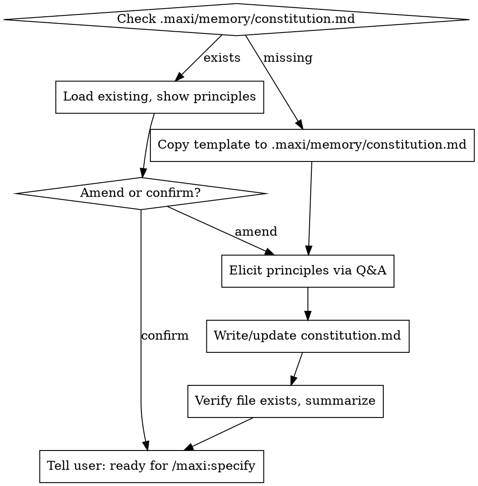

# constitution

Establish or amend the project constitution — the non-negotiable principles that all future `/maxi:*` skills will check against.

**Constitution is the mandatory first step.** All other maxi workflow skills (`/maxi:specify`, `/maxi:plan`, `/maxi:analyze`, etc.) will refuse to run until `.maxi/memory/constitution.md` exists.

## Canonical Locations

| What | Where |
|------|-------|
| Constitution file | `<project-root>/.maxi/memory/constitution.md` |
| Template | `<plugin-root>/templates/constitution-template.md` |

**Never put the constitution in the project root, `docs/`, or `.maxi/constitution.md`.** It must be at `.maxi/memory/constitution.md` exactly — that is the path every downstream skill checks.

## Process

## Elicitation Protocol

Ask one question at a time. Elicit 3–7 principles. Stop at 7.

**Core Principles (non-negotiable invariants)** — ask:
- "What is the single most important constraint this project must never violate?"
- "If a new developer breaks this rule, what should they be told?"
- "What trade-off has your team made that might surprise an outsider?"

**Development Conventions (preferred practices)** — ask:
- "What's your testing philosophy? TDD, test-after, integration-focused?"
- "Any strong preferences on code style, language version, or framework usage?"

**Constraints (external requirements)** — ask:
- "Any compliance, security, or deployment requirements that constrain the design?"
- "Third-party dependencies that are locked in or forbidden?"

## Critical Rules

- **Copy template first.** When creating a new constitution, copy `templates/constitution-template.md` into `.maxi/memory/constitution.md` before writing anything. Use the template's section structure.
- **Elicit, don't generate.** Never write generic principles ("write clean code", "test your work") that would apply to any project. Every principle must come from the user's answers.
- **Keep categories separate.** Core Principles ≠ Development Conventions ≠ Constraints. Conflating them makes the constitution unactionable for `/maxi:analyze`.
- **Minimum 3, maximum 7.** Fewer than 3 is incomplete. More than 7 is noise.
- **Verify on write.** After writing, confirm the file exists at `.maxi/memory/constitution.md`. If it doesn't, diagnose and retry.

## Red Flags

- Writing to any path other than `.maxi/memory/constitution.md` → **wrong path, redo**
- Generating content before asking any questions → **delete draft, elicit first**
- Mixing "use TypeScript strict mode" (convention) with "never store PII unencrypted" (constraint) in the same section → **separate them**
- Writing 10+ principles → **consolidate to 7 maximum**
