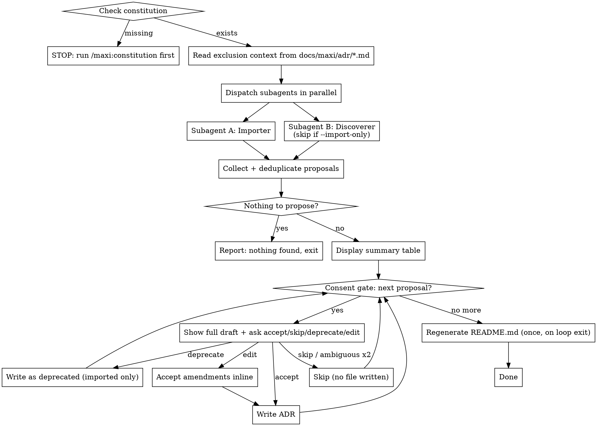

# migrate-adr

## Overview

Bootstraps `docs/maxi/adr/` from two parallel subagents:

1. **Importer** — scans known ADR directories, detects Nygard/MADR/plain-Markdown format, converts to maxi format
2. **Discoverer** — analyzes manifests, config files, directory structure, and git history to surface undocumented decisions

Non-destructive: originals are never deleted or moved. Standalone: no spec status required. `--import-only` skips the Discoverer.

**Trigger:** `/maxi:migrate-adr [--import-only]`

---

## Iron Rule: Never Write Without Consent

**Show every proposed ADR draft to the user and wait for explicit approval before writing any file. No exceptions.**

Rationalizations that are NEVER valid:

| Rationalization | Reality |
|----------------|---------|
| "The source format made the decision clear" | Still show draft. Still ask. |
| "The user already ran this command" | Still show draft. Still ask. |
| "Discovery produced too many proposals" | Show each one individually. Still ask. |
| "The user said 'go ahead'" | That applies only to the proposals already shown. Still ask per draft. |

---

## Process



---

## Step 1 — Prerequisites

Check `docs/maxi/constitution.md` exists.

- **Missing:** Stop immediately. Output: *"No constitution found. Run `/maxi:constitution` first."*
- **Present:** Continue.

---

## Step 2 — Read Exclusion Context

If `docs/maxi/adr/` exists and contains `NNNN-*.md` files: read each one and extract domain labels (primary technology/category) from titles and Decision sections. Also read `docs/maxi/adr/.rejected` if present (treat missing as empty) and add its labels to the exclusion context — see Step 6.

**Matching rule (token-set, not substring).** Normalize each label: lowercase, then **strip stopwords** (`use`, `for`, `the`, `a`, `as`, `with`, `to`). Build the **set of proper-noun (capitalized) tokens** from the original label; if a label has no proper-noun token, its longest remaining token of **3+ characters** forms a single-element set.

Compare a new proposal's set against each exclusion entry's set:

- **Equal sets** → exclude (already covered).
- **Partial overlap** (share ≥1 token but the sets are not equal) → **flag for the user, do NOT auto-exclude**.
- **No overlap** → keep.
- **No qualifying token** (all stopwords, or every candidate token is **shorter than 3 characters**, e.g. `go`, `js`) → flag for the user, never auto-exclude.

This biases against false exclusions: a generic residue token like `primary` or `store` never silently drops a proposal. On partial overlap the matcher must flag, not exclude. `.rejected` labels pass through the same normalization before matching.

Pass this exclusion list to both subagents. Neither subagent may propose a domain whose set is equal to an entry in the list; partial-overlap and no-qualifying-token cases are surfaced to the user instead.

---

## Step 3 — Dispatch Subagents in Parallel

Use `maxi:dispatching-parallel-agents`. Pass exclusion context to both. Also pass **the constitution's principles** (names/titles from `docs/maxi/constitution.md`) to Subagent B. With `--import-only`, dispatch only Subagent A.

**Return schema (both subagents MUST produce this).** Each subagent returns a list of proposals. Every proposal object includes:

| Field | Source | Notes |
|-------|--------|-------|
| `source` | both | `import` or `discover` |
| `domain_label` | both | primary technology/category (used for dedup + exclusion matching) |
| `title` | both | ADR title line |
| `body` | both | the full drafted ADR markdown |
| `format` | importer only | `nygard` \| `madr` \| `plain` |
| `source_path` | importer only | original file path (feeds the `source:` frontmatter) |

Steps 4 (deduplicate) and 5 (summary table) consume this structured list.

### Subagent A — Importer

Scan these directories for `.md` files:
`doc/adr/`, `docs/adr/`, `docs/decisions/`, `docs/architecture/`, `adr/`, `ADRs/`

**Filename blocklist (skip before format detection):** ignore any file whose basename (case-insensitive) is `README.md`, `index.md`, `template.md`, or `CONTRIBUTING.md`. These are not ADRs; without the blocklist a project `README.md` would be imported via the Plain-Markdown catch-all. Do **not** use a subjective "does the H1 look like a decision" heuristic — the blocklist plus the format-detection table below is the filter.

**Detect format per file:**

| Format | Signal |
|--------|--------|
| Nygard | No YAML frontmatter; has `## Status`, `## Context`, `## Decision`, `## Consequences` |
| MADR | YAML frontmatter with `title:`, `status:`, `deciders:` |
| Plain Markdown | H1 title; doesn't match Nygard or MADR |

Skip files matching no format (warn, continue). Skip files whose domain is in exclusion context.

**Nygard → maxi mapping:**

| Nygard field | maxi field |
|---|---|
| H1 title | slug + ADR title line |
| `## Status` value | `status:` frontmatter (Accepted→`accepted`, Proposed→`proposed`, Deprecated→`deprecated`, Superseded→`superseded`, Rejected→`deprecated`) |
| `## Context` | `## Context` |
| `## Decision` | `## Decision` |
| `## Consequences` | `## Consequences` |
| *(missing)* | `## Decision Drivers` — *"Not recorded in source ADR. Add drivers before accepting."* |
| *(missing)* | `## Considered Options` — *"Not recorded in source ADR."* |
| *(missing)* | `## Confirmation` — *"Not recorded in source ADR."* |

Nygard supersession: if `## Status` contains "Supersedes ADR-NNN", set `supersedes: null` in frontmatter and append to `## Context`: *"Source ADR referenced supersession — review and update `supersedes:` manually."*

**MADR → maxi mapping:**

| MADR field | maxi field |
|---|---|
| `title:` | slug + ADR title line |
| `status:` | `status:` frontmatter |
| `deciders:` | `decider:` frontmatter |
| `date:` | `date:` frontmatter |
| Context and Problem Statement | `## Context` |
| Decision Drivers | `## Decision Drivers` |
| Considered Options + Pros/Cons | `## Considered Options` |
| Decision Outcome | `## Decision` |
| Consequences subsection | `## Consequences` |
| *(missing)* | `## Confirmation` — placeholder |

**Plain Markdown:** Extract H1 as title. Look for date in filename (`YYYYMMDD-*` or `YYYY-MM-DD-*`) or first paragraph. Map body verbatim to `## Context`. All other sections → placeholders using the following explicit text:

- `## Decision Drivers` → *"Not recorded in source document. Add drivers before accepting."*
- `## Considered Options` → *"Not recorded in source document."*
- `## Decision` → *"Not recorded in source document."*
- `## Consequences` → *"Not recorded in source document."*
- `## Confirmation` → *"Not recorded in source document."*

**Frontmatter invariants for all imported ADRs:**

```yaml
date: [preserved from source, or "[unknown]" if not found]
updated: [today]
source: [original file path the ADR was imported from, or "[unknown]" if undeterminable]
related_specs: []
related_principles: []
related_requirements: []
supersedes: null
superseded_by: null
```

The `source:` field records provenance so every imported ADR points back at its original file.

### Subagent B — Discoverer

Analyze these layers:

| Layer | Examples |
|-------|---------|
| Package manifests | `package.json`, `Cargo.toml`, `go.mod`, `pyproject.toml`, `requirements.txt`, `pom.xml`, `build.gradle` |
| Config files | `Dockerfile`, `docker-compose.yml`, `.github/workflows/`, `.gitlab-ci.yml`, `tsconfig.json`, `eslint.config.*`, `.prettierrc`, `.env.example` |
| Directory structure | monorepo vs. polyrepo, layered/hexagonal/feature-based layout, test strategy |
| Git history | `git log -n 200 --format="%H %s%n%b"` — scan the output for commits whose subject OR body contains any of: `chose`, `decided`, `switched`, `migrated`, `replaced`, `adopted`, `dropped`, `moved to`; the full message body is already available in the output |

Skip domains in exclusion context.

**Significance rubric.** Propose a decision only if it meets at least one of: it is **costly to reverse**, it **constrains future choices**, or it **was contested** (a real alternative was weighed). A bare dependency in a manifest or a git-log keyword hit is **not** sufficient on its own — drop easily-reversible, uncontested choices (e.g. a code formatter). The consent gate is the user's filter, not the only filter; do not flood it with trivia.

**Constitution linkage.** You are given the constitution's principles (Step 3). When a discovered decision relates to a named principle, set `related_principles` to that principle and note the link in the draft's `## Context`. If no principle relates, leave `related_principles: []` — never fabricate a link.

**Default frontmatter for all discovered ADRs:**

```yaml
decider: "[unknown — inferred from code analysis]"
related_specs: []
related_principles: []
related_requirements: []
supersedes: null
superseded_by: null
date: [today]
updated: [today]
```

Mark uncertain fields with `[inferred]` prefix.

---

## Step 4 — Collect and Deduplicate

For each proposal, identify its primary domain label.

If Importer and Discoverer both propose the same domain:
- **Imported draft wins** as the base.
- Append discovery evidence to imported draft's `## Context` under `### Additional evidence`.
- Drop the discovered proposal.

When uncertain whether two proposals share a domain: **keep both**.

Import-only and discover-only proposals are kept as-is.

---

## Step 5 — Display Summary Table

```
Found N imported ADRs + M discovered decisions (K already covered by existing ADRs).

| #  | Source    | Topic                        |
|----|-----------|------------------------------|
|  1 | import    | PostgreSQL as primary store  |
|  2 | discover  | TypeScript strict mode       |

Final ADR numbers are assigned sequentially at write time (from the current
max in docs/maxi/adr/), not shown here — the # column is just a row index.
```

If nothing to propose: output *"Nothing to migrate and no architectural decisions detected. Use `/maxi:adr` to record decisions manually."* — exit cleanly.

---

## Step 6 — Consent Gate (One Proposal at a Time)

Process imported proposals first, then discovered proposals.

For each proposal: show the **full draft** and ask. The prompt offers explicit **verbs** — never a bare yes/no — so intent is never inferred. The verbs mean the same thing in both cases.

**Imported:**
> *"Import this as ADR-NNNN? (accept / skip / deprecate / edit)"*

| Response | Action |
|----------|--------|
| `accept` | Write with `status: accepted` |
| `skip` | No file written |
| `deprecate` | Write with `status: deprecated` (preserve the historical decision without adopting it — you can supersede it later with `/maxi:adr`) |
| `edit` | Accept amendments inline, write with `status: accepted` |

**Discovered:**
> *"Record this as ADR-NNNN? (accept / skip / edit)"*

| Response | Action |
|----------|--------|
| `accept` | Write with `status: accepted` |
| `skip` | Discard — no file written |
| `edit` | Accept amendments inline, write with `status: accepted` |

**Ambiguous responses** ("ok", "sure", "looks good", "yes", "no", "cancel", silence): do not infer intent. Re-ask once, naming the explicit verbs for that case:

- For **imported** proposals: *"Please choose a verb: accept (write accepted) / skip (no file) / deprecate (write deprecated)."*
- For **discovered** proposals: *"Please choose a verb: accept (write accepted) / skip (no file)."*

If the **second** response is still ambiguous, default to `skip` — no file is written. Never write on an unresolved response.

**Rejection log (`docs/maxi/adr/.rejected`).** On `skip` of a **discovered** proposal, **append its domain label** to `docs/maxi/adr/.rejected` (one label per line; create the file with a leading `#`-comment header explaining its purpose on first write). Step 2 reads this file into the exclusion context, so a later re-run does not re-propose the same decision. On `skip` of an **imported** proposal, do nothing — imported skips are **not logged**, because the original source file on disk is already the record. Writing to `.rejected` is internal **bookkeeping**, not an ADR; it is therefore exempt from the consent gate / Iron Rule (which governs ADR file creation only).

**NNNN is computed from the current max in `docs/maxi/adr/` at write time** — not at proposal time.

Regeneration rule: regenerate `docs/maxi/adr/README.md` **once**, after the consent loop completes (on early exit, regenerate for whatever was written) — not after every write. The README is a table with columns: ADR number, title, status, date, related specs.

---

## Guards

| Condition | Behaviour |
|-----------|-----------|
| No `docs/maxi/constitution.md` | Stop: *"No constitution found. Run `/maxi:constitution` first."* |
| No ADRs found + no codebase signals | Report + exit cleanly |
| Importer finds nothing | Report; Discoverer still runs (unless `--import-only`) |
| Discoverer finds nothing | Report; Importer results still presented |
| Unsupported file format | Skip with warning, continue |
| `docs/maxi/adr/` non-empty | Read first → build exclusion context; then append new ADRs |
| `--import-only` flag | Subagent B not dispatched |

---

## Out of Scope

- Deleting or moving original ADR files
- Migrating ADRs between two maxi projects
- Bulk-accepting all proposals without consent
- Retroactively editing existing `docs/maxi/adr/` files (append-only)

---

## Common Mistakes

| Mistake | Correct behaviour |
|---------|-------------------|
| Writing any file before showing the draft | Always show draft first, wait for accept/skip/deprecate/edit |
| Skipping a proposal without asking | Every proposal must go through the consent gate |
| Treating "ok" or silence as accept | Ambiguous = re-ask once naming the verbs; second ambiguous defaults to `skip` (no file) |
| Computing NNNN at proposal time | Compute NNNN from current max **at write time** |
| Regenerating README.md after every write | Regenerate **once** at the end of the consent loop (partial regen on early exit) |
| Proposing a domain already in exclusion context | Check exclusion list before proposing |
| Dispatching subagents without exclusion context | Pass exclusion list to both A and B |
