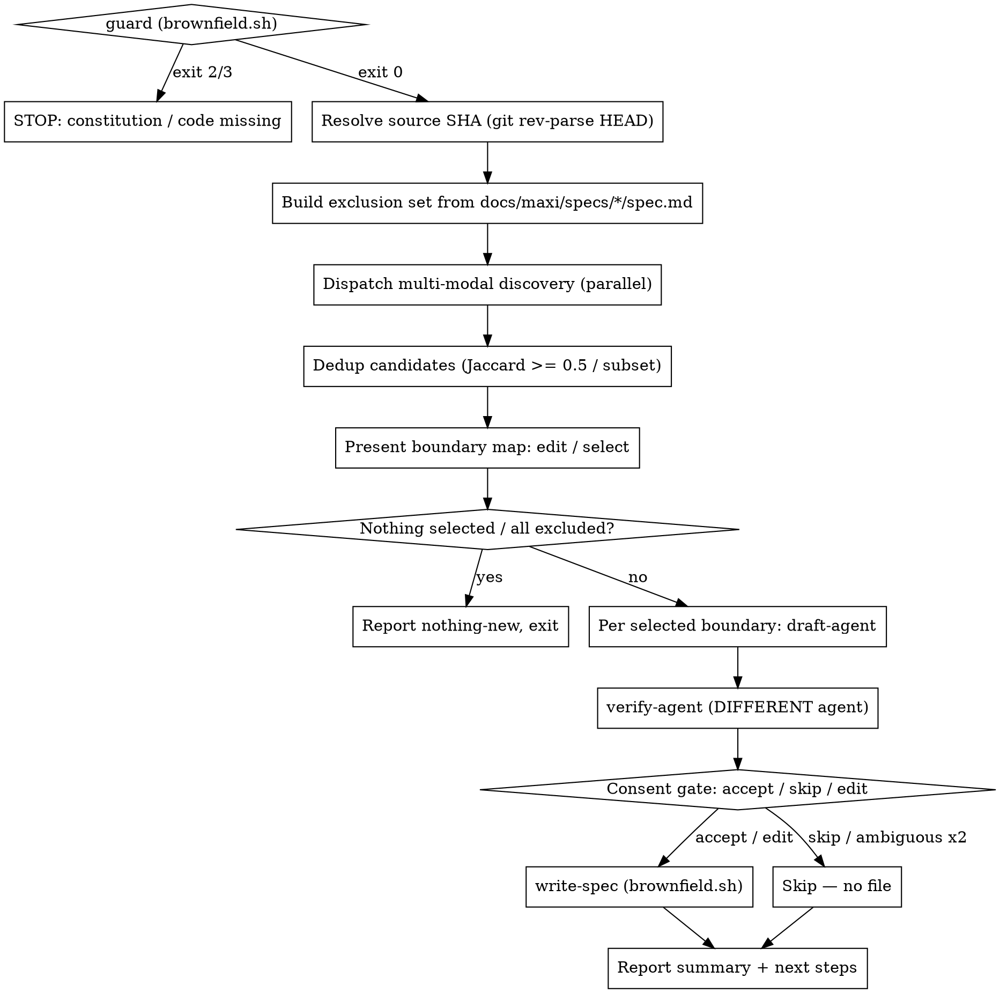

# migrate-from-brownfield

## Overview

Reverse-engineers an existing codebase into faithful, traceable `spec.md`
baselines so a brownfield project can adopt spec-driven development. The skill
**discovers** feature boundaries, **drafts** an as-built spec per boundary,
**adversarially verifies** each draft against the real code, and writes the
accepted ones at `status: done` with `origin: reverse-engineered` provenance.

It produces specs and nothing else (Constitution Principle VI). The done-on-creation
behavior is sanctioned by the constitution's migration-ingress clause and ADR-0011.

**This is a coordinator.** The deterministic file-ops live in
[`brownfield.sh`](brownfield.sh) (`guard` | `write-spec` | `exclude`); the
agent work lives in three subagent briefs. The skill orchestrates them and owns
the interactive gates — it does NOT reimplement their logic.

---

## Iron Rule: Never Write Without Consent

**Show every vetted draft to the user and wait for an explicit `accept` or `edit`
before writing any file. No exceptions.**

| Rationalization | Reality |
|----------------|---------|
| "Discovery was confident about this boundary" | Still show the draft. Still ask. |
| "The verifier already checked it against code" | Verification is not consent. Still ask. |
| "The user already ran the command" | That starts the run; it is not per-spec consent. Still ask. |
| "The user said 'go ahead' earlier" | That applied to the draft already shown. Ask again for this one. |
| "There are too many boundaries to ask each time" | Ask per draft anyway. Serial consent is the rule. |

**Violating the letter of this rule violates its spirit.**

---

## Prerequisites

Run `bash skills/migrate-from-brownfield/brownfield.sh guard` from the project root first:

- **Exit 2 — no constitution:** stop. *"No constitution found. Run `/maxi:constitution` first."* (and suggest `/maxi:migrate-adr` separately for ADRs).
- **Exit 3 — no recognized code:** stop cleanly. *"No source code found. Nothing to reverse-engineer."*
- **Exit 0:** continue.

---

## Workflow



### Step 1 — Guard + SHA

Run `brownfield.sh guard`. On exit 0, resolve `SHA=$(git rev-parse HEAD)` — every
written spec records the exact code state it was reverse-engineered from.

### Step 2 — Exclusion set (idempotency)

Read existing `docs/maxi/specs/*/spec.md` to build the exclusion set so re-runs are
resumable. For each candidate, decide with:

```bash
bash skills/migrate-from-brownfield/brownfield.sh exclude --name <name> --paths <p1,p2,...>
```

- `exclude` → already documented; drop it.
- `flag` → **partial** overlap; surface to the user, never auto-exclude.
- `keep` → new; propose it.

Matching is **path-overlap primary** (against reverse-engineered specs' `file:line`
refs); a **name token-set fallback** covers ref-less forward-pipeline specs. Both
live inside `brownfield.sh exclude` — do not reimplement.

### Step 3 — Multi-modal discovery

Dispatch discovery in parallel (**REQUIRED SUB-SKILL:** `maxi:dispatching-parallel-agents`)
using [`discover-subagent.md`](discover-subagent.md) — one agent per lens
(`directory`, `entrypoint`, `manifest`, `route`), each passed the exclusion set.
Each returns `BoundaryCandidate[]` with `backing_paths` evidence.

**Dedup** the merged candidates: merge two when their `backing_paths` sets overlap
by Jaccard ≥ 0.5 or one is a subset of the other (union paths, keep the longer
name, record all lenses). Overlap > 0 but below threshold → keep both, mark
"possibly related".

### Step 4 — Boundary map (edit / select)

Present the deduped map. The user may **collapse / split / rename / sequence** and
select which boundaries to document this run. If discovery returned nothing (a
structureless monolith), propose a **single whole-project floor** candidate the
user can split.

### Step 5 — Per boundary: draft → verify (parallel fan-out)

For each selected boundary, run `draft-agent → verify-agent`:
- **Draft** via [`draft-subagent.md`](draft-subagent.md) → `DraftedSpec` (full
  maxi schema, as-built scenarios, `file:line` on every FR).
- **Verify** via [`verify-subagent.md`](verify-subagent.md) — a **different**
  agent — → `Verdict` with a corrected `revised_spec_markdown`. The user only ever
  sees a vetted draft.

### Step 6 — Consent gate (serial)

For each vetted draft, show it and ask:

> *"Record this boundary as a spec baseline? (accept / skip / edit)"*

| Response | Action |
|----------|--------|
| `accept` | Write it (see below). |
| `edit` | Apply the user's amendments, then write immediately — **no second confirmation**. |
| `skip` | No file written. |

**Ambiguous** ("ok", "sure", "looks good", silence): do not infer. Re-ask once
naming the verbs. If the **second** response is still ambiguous, default to `skip`.
**No file is written without an explicit `accept` or `edit`** — both write; nothing
else does.

On `accept`/`edit`, first **check for a slug collision** — `write-spec` auto-numbers
`NNNN` but does **not** detect a duplicate slug *suffix*, so grep `docs/maxi/specs/`
for an existing `*-<slug>` directory. If one exists, ask the user for a disambiguating
suffix and use that. Then write the vetted markdown to a temp file and run:

```bash
bash skills/migrate-from-brownfield/brownfield.sh write-spec --slug <slug> --body <file> --sha "$SHA"
```

`write-spec` computes `NNNN` from the current max **at write time**, emits the
frontmatter (`status: done`, `origin: reverse-engineered`, `source_sha`) and the
`## Migration Notes` section. **Never hand-write that frontmatter.** Writes are
serial, so numbering stays race-free.

### Step 7 — Report

Summarize what was written (slugs + paths), what was skipped, and that originals
are untouched. Suggest re-running to document more boundaries, or `/maxi:migrate-adr`
for the ADR log.

---

## Guards

| Condition | Behaviour |
|-----------|-----------|
| No `docs/maxi/constitution.md` | `guard` exits 2 → stop, point to `/maxi:constitution` |
| No recognized code | `guard` exits 3 → stop cleanly |
| Structureless repo (no clean boundaries) | Propose a single whole-project floor candidate |
| Slug suffix already used by another spec dir | Coordinator greps `docs/maxi/specs/*-<slug>` **before** writing and asks for a disambiguating suffix (like `/maxi:specify`); `write-spec` only auto-numbers `NNNN` |
| All discovered boundaries already documented | Report nothing-new, exit cleanly |
| Verifier cannot confirm a requirement | Drop it (handled in the verify brief); never ship unsupported claims |

---

## Out of Scope (single-responsibility)

- Bootstrapping a constitution (use `/maxi:constitution`).
- Generating or discovering ADRs (use `/maxi:migrate-adr`).
- Fabricating `plan.md` / `tasks.md` — reverse-engineered specs land at `done`.
- Deleting, moving, or modifying any existing code or spec files.

---

## Artifact reference links

When this skill emits prose that references another maxi artifact (an ADR, spec, plan, tasks, constitution, or repo file) — in an artifact body or in a chat report — render it as a **relative Markdown link**, not a bare slug/number/code span:
- **Visible text** = the target filename without `.md` (an ADR slug like `0003-constitution-decoupled-from-claudemd`; for generic spec artifacts use `<feature-dir>/<name>`, e.g. `0002-migrate-adr-review-fixes/spec`; non-`.md` files keep their full name).
- **URL** = a relative path from the referencing file's directory (workspace-root-relative for chat reports).
- **Do NOT** link frontmatter data values (`related_adrs` entries stay bare slugs) or within-document IDs (`FR-012`, section names).
- Applies **forward-only** — do not retro-edit existing artifacts.

## Red Flags — STOP

- Writing any spec before the user said `accept`/`edit` → show draft first, always.
- Treating "ok" or silence as `accept` → re-ask once, then default `skip`.
- Hand-writing `status:`/`origin:`/`source_sha`/Migration Notes → `write-spec` emits them.
- Letting the **same** agent draft and verify a boundary → verification must be independent.
- Re-proposing a boundary the exclusion set covers → run `brownfield.sh exclude` first.
- Auto-excluding on a `flag` (partial overlap) → surface it to the user.

## Common Mistakes

| Mistake | Correct behaviour |
|---------|-------------------|
| Reimplementing discovery/draft/verify inline | Dispatch the subagent briefs; the skill only coordinates |
| Computing NNNN at proposal time | `write-spec` computes it at write time |
| Drafting an aspirational spec | As-built only — describe what the code does, FRs carry `file:line` |
| Skipping the boundary-map review | Always let the user edit/select before drafting |
| Documenting the whole repo at once | Let the user sequence it into waves |
