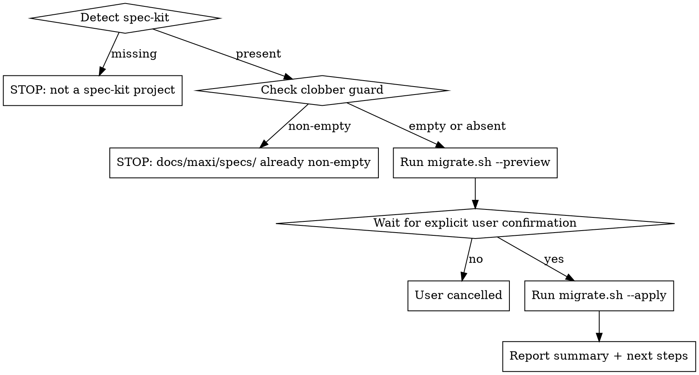

# migrate-from-speckit

One-shot migration from [github-spec-kit](https://github.com/github/spec-kit) to maxi conventions. Copies specs to `docs/maxi/specs/`, copies the constitution to `docs/constitution.md`, adds YAML frontmatter, and infers maxi status from files present.

**Non-destructive:** originals in `specs/` and `.specify/` are never touched.

## The Iron Rule: Always Use migrate.sh

**You MUST run `migrate.sh` for ALL file operations.** Do NOT implement the migration logic yourself with bash loops, Edit tool calls, or Read/Write sequences.

Rationalizations that are NEVER valid:
- "I'll do it with bash — more transparent" → `migrate.sh` handles everything
- "I only need to add frontmatter to a few files" → still use `migrate.sh`
- "The script feels like a black box" → the script IS the implementation; the skill IS the workflow

## Prerequisites

Before anything else, verify you are in a spec-kit project:

1. `.specify/` directory exists at CWD
2. At least one `specs/NNN-*` directory exists

If either is missing: stop immediately.
> *"Not a spec-kit project: `.specify/` or `specs/NNN-*` not found. Nothing to migrate."*

## Workflow



## Step-by-Step

**Step 1 — Detection**

```bash
[[ -d .specify ]] || die
compgen -G "specs/[0-9][0-9][0-9]-*" >/dev/null || die
```

Stop with the message above if either check fails.

**Step 2 — Clobber guard**

```bash
if [[ -d docs/maxi/specs ]] && [[ -n "$(ls -A docs/maxi/specs 2>/dev/null)" ]]; then
  echo "docs/maxi/specs/ already exists and is non-empty. Aborting."
  exit 1
fi
```

Do not proceed past this point without a clean target.

**Step 3 — Preview**

```bash
bash skills/migrate-from-speckit/migrate.sh --preview
```

The script prints a manifest: constitution path, every spec's source → target, its inferred status (and the reason), and which aux files are present.

**Step 4 — Confirm**

Show the preview output to the user. Ask: *"Proceed with migration? (y/N)"*

Wait for explicit `y` or `yes`. Any other response → abort.

**Step 5 — Apply**

```bash
bash skills/migrate-from-speckit/migrate.sh --apply
```

The script does the work. Report its output to the user verbatim.

**Step 6 — Report next steps**

After `--apply` exits 0, tell the user:

> "Migration complete. Originals in `specs/` and `.specify/` are untouched. Review `docs/maxi/specs/`, then run `/maxi:specify` to add new features."

## What migrate.sh does (reference)

The script handles these transforms — you do NOT need to re-implement any of this:

| What | How |
|------|-----|
| Constitution | Copies `.specify/memory/constitution.md` → `docs/constitution.md` (skips if target exists) |
| Spec dirs | `cp -r specs/NNN-slug/ docs/maxi/specs/NNN-slug/` |
| spec.md frontmatter | Prepends YAML `slug/created/updated/status`; strips inline `**Status**:`, `**Created**:`, `**Feature Branch**:`, `**Input**:` lines |
| Status inference | Shipped OR retrospective.md → `done`; tasks.md → `tasked`; plan.md → `planned`; else → `specified` |
| plan.md / tasks.md | Prepends YAML frontmatter if absent |
| Missing spec.md | Warns and skips the folder; does not abort |
| Aux files | `contracts/`, `data-model.md`, `quickstart.md`, `research.md`, `retrospective.md` — copied verbatim |

## Red Flags

- Calling `migrate.sh` once then manually editing individual files → don't; the script handles all transforms
- Asking the user "should I delete `specs/` or `.specify/`?" → originals stay; do not ask
- Proceeding without explicit confirmation after the preview → always wait for `y`
- Running `--apply` against a non-empty `docs/maxi/specs/` → the clobber guard fires; stop
- Using `git mv` instead of `cp` → originals must be preserved; use cp only
