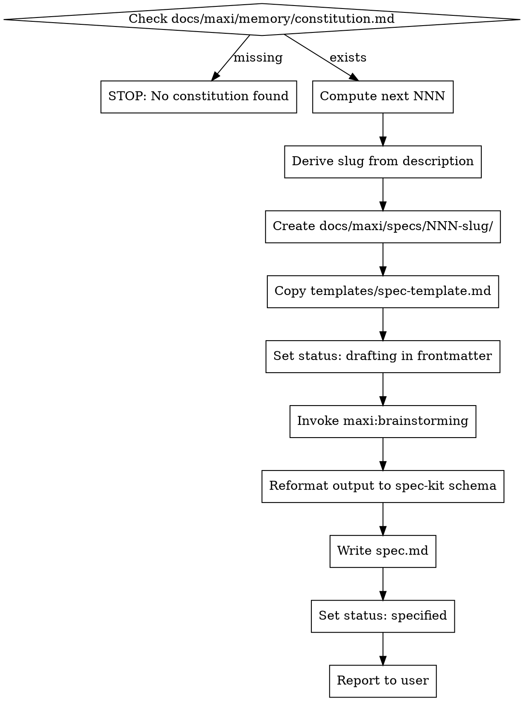

# specify

Create a new feature specification. Invokes `maxi:brainstorming` for design dialogue, then formats output into `docs/maxi/specs/NNN-slug/spec.md`.

## Prereqs

- `docs/maxi/memory/constitution.md` must exist — if missing, stop: *"No constitution found. Run `/maxi:constitution` first to establish project principles."*
- No `spec.md` status prereq (this skill creates the spec)

## Process



## Step-by-Step

**Step 1 — Prereq check**

Read `docs/maxi/memory/constitution.md`. If it does not exist, stop immediately:

> *"No constitution found. Run `/maxi:constitution` first to establish project principles."*

Do not proceed past this step without the constitution file.

**Step 2 — Compute next feature number**

Scan `docs/maxi/specs/` for directories matching the pattern `NNN-*` (three-digit numeric prefix). Find the highest NNN. Add 1. If no specs directory exists or no `NNN-*` directories are found, use `001`.

Examples:
- No specs → `001`
- Existing: `001-auth`, `002-export` → next is `003`
- Existing: `001-auth`, `003-export` (gap) → next is `004`

**Step 3 — Derive slug**

Kebab-case the feature description. Max 5 words. Drop stop words (a, the, an, to, for, of). Lowercase.

Examples:
- "build a CSV to JSON converter" → `csv-to-json-converter`
- "add user authentication with OAuth" → `user-authentication-oauth`
- "send email notifications" → `send-email-notifications`

**Step 4 — Create directory and copy template**

Create `docs/maxi/specs/NNN-slug/`.

Copy `templates/spec-template.md` to `docs/maxi/specs/NNN-slug/spec.md`.

**NEVER write spec.md from scratch.** Always start from the template. This applies even if:
- The feature is simple
- The user says "just a quick spec"
- A previous spec looks similar

**Step 5 — Set initial frontmatter**

Update the frontmatter in the copied `spec.md`:

```yaml
---
slug: NNN-slug
created: [today's ISO date, e.g. 2026-05-08]
status: drafting
---
```

**Step 6 — Invoke maxi:brainstorming**

**REQUIRED SUB-SKILL:** Invoke `maxi:brainstorming` with the feature description as context.

Wait for brainstorming to complete its full elicitation dialogue. Do NOT write any spec content (FR-###, user stories, SC-###) before brainstorming completes.

Rationalization to reject: *"I have enough context to write the spec directly."* — brainstorming is not optional.

**Step 7 — Reformat brainstorming output into spec-kit schema**

Map every element of the brainstorming output to the spec-kit schema. No freeform sections:

| Brainstorming output | spec-kit format |
|---|---|
| User journeys / workflows | `### User Story N - [Title] (Priority: PN)` with `**Why this priority**`, `**Independent Test**`, `**Acceptance Scenarios**` |
| Functional requirements | `**FR-001**: System MUST ...` (sequential, starting at FR-001) |
| Success criteria / metrics | `**SC-001**: [Measurable outcome]` (sequential, starting at SC-001) |
| Edge cases | `### Edge Cases` section under User Scenarios |
| Assumptions / constraints | `## Assumptions` section |

Every user story MUST have:
- A priority (P1 = most critical, P2 = important, P3 = nice to have)
- An `**Independent Test**` field
- At least one `**Acceptance Scenarios**` entry in Given/When/Then format

**Step 8 — Write spec.md and transition status**

Overwrite `docs/maxi/specs/NNN-slug/spec.md` with the fully formatted spec. Update frontmatter:

```yaml
status: drafting  →  status: specified
```

`status: specified` is only set **after** spec.md is fully written and verified. Never set it before.

**Step 9 — Report to user**

Tell the user:

> "Spec created at `docs/maxi/specs/NNN-slug/spec.md` (status: `specified`). Next step: `/maxi:clarify` to resolve open questions, or `/maxi:plan` to proceed to planning."

## Critical Rules

- **Constitution first.** Hard stop if `docs/maxi/memory/constitution.md` is missing. No exceptions.
- **Template first.** Never write `spec.md` from scratch. Always copy `templates/spec-template.md` as the base.
- **Compute NNN, don't guess.** Scan `docs/maxi/specs/` for existing `NNN-*` dirs. Take max + 1.
- **brainstorming before content.** Do NOT write FR-### or user stories until `maxi:brainstorming` completes. This applies even if the feature is simple or the user wants a quick spec.
- **Schema compliance is not optional.** Every user story gets a priority (P1/P2/P3), an `Independent Test`, and `Acceptance Scenarios`. Every requirement is `FR-NNN`. Every success criterion is `SC-NNN`. "Feature is too simple" is not an exemption.
- **Status transition is atomic.** Set `status: drafting` on creation. Set `status: specified` only after spec.md is fully written and verified.
- **Path is fixed.** Specs live in `docs/maxi/specs/NNN-slug/spec.md` — not `docs/specs/`, not `.specify/`, not the project root.
- **Never copy a previous spec as the template.** Even if the feature is similar to an existing spec, always copy `templates/spec-template.md`. Previous specs may have customizations that corrupt the schema.

## Red Flags

- Creating `spec.md` before invoking `maxi:brainstorming` → wait for brainstorming first
- Using `.specify/`, `docs/specs/`, `specs/`, or project root instead of `docs/maxi/specs/` → wrong path
- Writing `Feature 1:` or `1.` instead of `FR-001:` → schema violation
- Writing `### Requirements` without `FR-###` numbering → schema violation
- Setting `status: specified` before spec.md is fully written → premature transition
- Setting `status: done`, `status: draft`, or any value other than `drafting` at creation → wrong value
- NNN made up instead of computed → always scan `docs/maxi/specs/` for the next number
- Copying a previous spec as a starting point instead of the template → always use `templates/spec-template.md`
- User said "just a quick spec" or "this is simple, skip the details" → schema compliance is mandatory regardless of perceived simplicity
- Skipping `Independent Test` field on a user story → every story requires one
