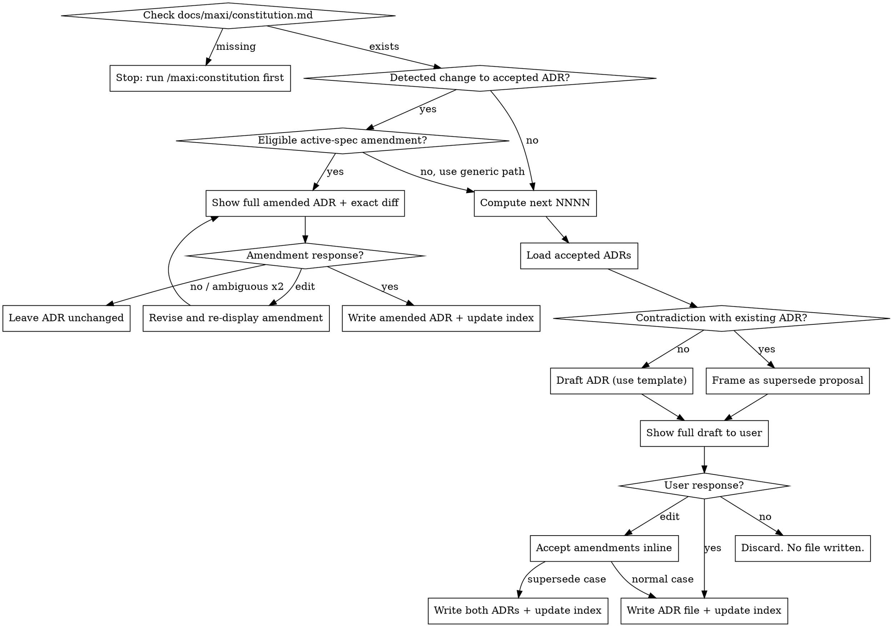

# maxi: Recording Architecture Decision Records (ADRs)

## Overview

This is an **internal pipeline skill** — it is invoked by Maxi workflows, not by the user directly. It is not listed in the `/maxi:*` command menu.

**Core principle:** ADRs capture the *why* behind architectural choices. They are **never written silently** — the agent always drafts the ADR, shows it to the user, and waits for explicit approval before any file is created.

## Prerequisites

Before doing anything else:

1. Check that `docs/maxi/constitution.md` exists. If it does not: stop immediately with *"No constitution found. Run `/maxi:constitution` first."*
2. Proceed only when constitution is confirmed present.

## The Iron Rule: Never Write Without Consent

**You MUST show the full drafted ADR and receive explicit consent before writing any file. An amendment requires `yes`; `edit` only revises and re-displays it.**

The fact that the calling workflow already identified the decision does NOT count as user consent to write the ADR. The user must see the draft and confirm.

**Rationalizations that are NEVER valid:**
- "The plan made the decision explicit" → still show draft, still ask
- "The context was clear enough" → still show draft, still ask
- "The user asked me to record it" → still show draft, still ask
- "The contradiction isn't really a conflict" → still surface it, let the user decide

## Amendment Eligibility

Every new ADR records exactly one creating spec: `spec: <full-spec-slug>` or `spec: null`.
When an agent detects a change to an accepted ADR, first inspect the linked spec frontmatter: `reopened_from: done` makes it ineligible for amendment and requires supersession, even while it is active. Amend only when its `spec:` equals the current active spec slug, that spec is active (`drafting`, `specified`, `clarified`, `planned`, `tasked`, `analyzed`, or `implementing`), and its initial lifecycle never reached `done` (it lacks `reopened_from: done`).
If the link is missing or null, use supersession. If the linked spec is done, parked, or cancelled, use supersession. A missing linked spec also uses supersession.

## Process



## Step-by-Step

### 1. Route an accepted ADR change before supersession

When an agent detects a changed accepted ADR, inspect the linked spec's `reopened_from: done` watermark before active-spec eligibility: a reopened spec uses supersession even if its spec is active; only an initial active lifecycle that never reached `done` and lacks `reopened_from: done` remains eligible for amendment. Evaluate that eligibility before loading accepted ADRs for generic contradiction handling. An eligible change goes directly to the amendment procedure below and never enters the generic supersession path. An ineligible change, including a missing, `null`, closed, or reopened `spec:` link, continues to the existing generic path, which offers supersession. If no accepted ADR changed, continue to step 2.

### 2. Compute next NNNN

Scan `docs/maxi/adr/` for files matching `NNNN-*.md` (excluding `README.md`). Extract the numeric prefix of each file and find the highest value. Next NNNN = highest + 1, zero-padded to 4 digits. If the directory does not exist or contains no matching files, NNNN = 0001.

Use max-based numbering (not count-based) to survive deletions, renames, or manual additions — these operations change the count but not the highest assigned number.

### 3. Load accepted ADRs for contradiction check

Read every `docs/maxi/adr/NNNN-*.md` (where status = `accepted`) and scan their Decision sections for domain overlap with the new decision (same technology category: storage, runtime, framework, auth mechanism, etc.).

**Surface any overlap to the user — do not decide silently.** You are not qualified to judge whether two decisions in the same domain are contradictory or simply different contexts. The user is. If there is any resemblance in domain, show it to the user and let them decide whether to supersede or treat as independent.

### 4. Draft the ADR

Verify `adr-template.md` exists (Read tool) before proceeding; if missing, stop: *"Cannot proceed — `adr-template.md` is missing. Please reinstall the maxi plugin."*

Use `adr-template.md` as the base. Fill in:

- `adr:` — the 4-digit number
- `slug:` — `NNNN-[short-kebab-title]`
- `spec:` — replace the template's `null` with the current active spec slug when this ADR is created for that spec; otherwise keep `spec: null`
- `status: proposed` ← draft state; transitions to `accepted` when user confirms
- `created:` — today in YYYY-MM-DD
- `updated:` — today in YYYY-MM-DD
- `decider:` — name or role of the decision-maker (ask user if unknown)
- `supersedes:` — NNNN of the ADR being overturned (or `null`)
- `superseded_by: null`

Body: fill all six sections from the architectural choice that was detected:

- **Context** — the forces, constraints, and goals that made this decision necessary
- **Decision Drivers** — list 2–4 criteria that determine which option wins. Derive from:
  - The relevant constitution principles (e.g., "III. Data Integrity First") — cite them inline as prose in Context / Decision Drivers
  - The relevant spec requirements (FR-###, SC-###) — cite the IDs inline as prose in Context / Decision Drivers
  - Explicit constraints from the plan (e.g., "must support 100+ concurrent writes")
  Never leave this section empty — if no requirements are referenced, state the implicit constraint that drove the choice.
- **Considered Options** — for each option, add ✅/❌ lines that reference a specific driver:
  `✅ Satisfies driver: <criterion>` or `❌ Violates driver: <criterion>`
  Generic ✅/❌ without driver reference are not sufficient.
- **Decision** — the chosen option with a concise rationale tied to the drivers
- **Consequences** — concrete implications of the chosen option (Good/Bad)
- **Confirmation** — how the decision will be verified or enforced over time

### 5. Frame supersede proposal (if contradiction found)

If this decision contradicts an existing accepted ADR (say ADR-003), present the draft with this header:

> **This decision appears to contradict ADR-003 ("original title").** Propose ADR-NNNN that supersedes ADR-003?

The proposal shows the full new ADR draft. The user can say yes, edit, or no.

### 6. Show to user and wait

Output the full ADR as formatted Markdown and ask:

> *"Record this as ADR-NNNN? (yes / no / edit)"*

Wait for the response. Do not write anything yet.

### Amendment: propose an eligible active-spec change

Do not create a replacement ADR when the eligibility conditions above hold. Show the full amended ADR and exact diff.

> *"Apply this amendment to ADR-NNNN? (yes / no)"*

**`yes`:** Write the amended ADR in place, refresh `updated:` to today's ISO date, and regenerate the index.

**`edit`:** Revise and re-display the full amended ADR and exact diff, then ask the same question again. Only `yes` may write an amendment; `edit` is not consent to write.

**`no`:** Leave the ADR unchanged.

**Anything else:** Re-ask the same amendment question once. On no or two ambiguous responses, leave the ADR unchanged. The amendment preserves `adr`, `slug`, `spec`, `created`, `status`, `supersedes`, and `superseded_by`; it changes the body and refreshes `updated:` to today's ISO date. It never changes ADR identity or supersession links, and never creates a new ADR.

### 7. Handle new-ADR response

**`yes`:**
- Normal case: set `status: accepted` in the ADR, then write `docs/maxi/adr/NNNN-slug.md`, then regenerate index (step 7)
- Supersede case: write new ADR; also update old ADR — set `status: superseded` and `superseded_by: NNNN`; then regenerate index. If any of the three writes fails, stop and report the failure — do not leave the ADR log in a partially-written state.
- **Spec back-link (both cases):** if this ADR was accepted in the context of an active spec — the calling workflow knows the spec directory — append this ADR's full slug (e.g. `NNNN-slug`) to that spec's `related_adrs` frontmatter list (create the list if absent; do not duplicate if already present) and bump the spec's `updated:` to today's ISO date, written in the same edit. If there is no active spec, skip this silently — the ADR still stands.

**`edit`:**
- Accept the user's amendments to the draft inline
- Apply them to the ADR content
- Write the amended version (normal or supersede rules above)

**`no`:**
- Discard the draft. Do not create any file. Return to the calling skill.

**Anything else (silence, "ok", "sure", "looks good", "cancel", "skip", ambiguous text):**
- Treat as `no` — do not write anything. Re-ask the question once: *"To confirm: skip recording this decision? (yes to record / no to skip)"*. If still ambiguous, treat as no and move on.

### 8. Regenerate docs/maxi/adr/README.md

After every successful write, rewrite the index by scanning all `.md` files in `docs/maxi/adr/` (excluding `README.md`). Sort by ADR number ascending. Read each ADR file's own frontmatter and H1 for the **ADR**, **Title**, **Status**, and **Created** columns. Status must reflect the current frontmatter value (including `superseded` or `deprecated` — do not default to `accepted`).

The **Related Specs** column is built by **reverse-lookup** — ADRs no longer carry a `related_specs` field, so the linkage is read from the spec side:

1. Scan every `docs/maxi/specs/*/spec.md` and read its `related_adrs` frontmatter list (a list of full ADR slugs like `0003-constitution-decoupled-from-claudemd`).
2. For each ADR in the index, the Related Specs cell lists the slug of every spec whose `related_adrs` contains that ADR's slug.
3. If no spec references the ADR, write `—`.

```markdown
# Architecture Decision Records

| ADR | Title | Status | Created | Related Specs |
|-----|-------|--------|---------|---------------|
| [0001](0001-slug.md) | Title of decision | accepted | 2026-05-08 | 0001-csv-to-json |
| [0002](0002-slug.md) | Another decision | superseded | 2026-05-15 | — |
```

## Append-Only After Creation

An eligible amendment for an initial active lifecycle that lacks `reopened_from: done` is the sole exception and must use the full-draft, exact-diff, explicit-`yes` procedure above. Otherwise, once an ADR is written, its **content is immutable**. These fields MAY be updated:
- `status` (accepted → deprecated or superseded)
- `superseded_by`
- `supersedes`

These fields and the body sections MUST NOT be edited on an existing ADR:
- Any body section (Context, Decision Drivers, Options, Decision, Consequences, Confirmation)
- `adr`, `slug`, `created`

If the user wants to revise a past decision, create a new ADR that supersedes the old one. The old one stays as a historical record.

**If asked to edit an ineligible ADR's body:** decline and explain — *"ADRs are append-only. To revise this decision, I can create ADR-NNNN that supersedes ADR-NNNN. Shall I?"*

## Artifact reference links

When this skill emits prose that references another maxi artifact (an ADR, spec, plan, tasks, constitution, or repo file) — in an artifact body or in a chat report — render it as a **relative Markdown link**, not a bare slug/number/code span:
- **Visible text** = the target filename without `.md` (an ADR slug like `0003-constitution-decoupled-from-claudemd`; for generic spec artifacts use `<feature-dir>/<name>`, e.g. `0002-migrate-adr-review-fixes/spec`; non-`.md` files keep their full name).
- **URL** = a relative path from the referencing file's directory (workspace-root-relative for chat reports).
- **Do NOT** link frontmatter data values (`related_adrs` entries stay bare slugs) or within-document IDs (`FR-012`, section names).
- Applies **forward-only** — do not retro-edit existing artifacts.

## Common Mistakes

| Mistake | Correct behaviour |
|---------|-------------------|
| Writing the file before showing the draft | Always show draft first, wait for yes |
| Deciding "this isn't really a contradiction" silently | Surface any resemblance, let user decide |
| Using a manually constructed frontmatter | Use `adr-template.md` as base |
| Picking a number without counting existing files | Count `docs/maxi/adr/*.md` (excluding README), add 1 |
| Forgetting to regenerate README.md | Always regenerate after every write |
| Editing an ineligible ADR body | Decline; offer to supersede instead |
| Writing the ADR but forgetting the spec back-link | On acceptance with an active spec, append the ADR slug to the spec's `related_adrs` and bump its `updated:` |
